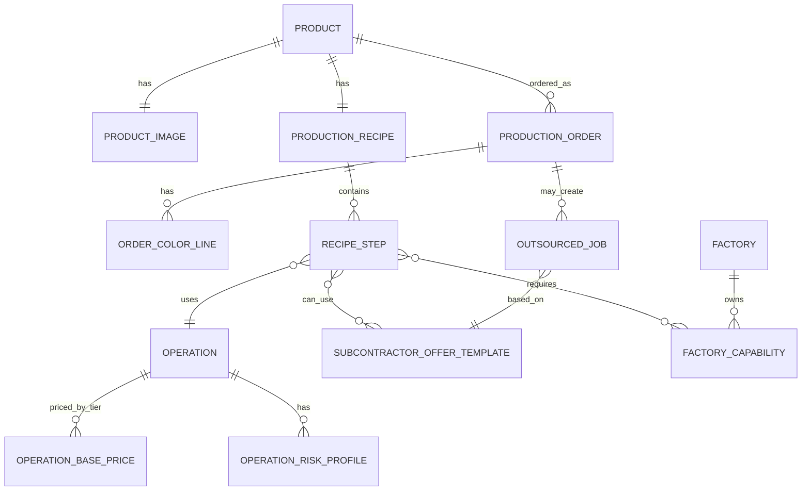

# Ürün Reçetesi, Admin Kurulumu ve Risk Modeli

## Amaç

Bu doküman admin tarafından ürün oluşturulurken tanımlanacak ürün verisini, üretim reçetesini, fiyat metriklerini, operasyon sürelerini, renk dağılımını ve risk profilini tanımlar.

Ürün, Factory Runway'in merkezi veri yapılarından biridir. Oyuncuya gösterilen sipariş teklifi sade görünür, fakat arka planda ürün reçetesi, operasyon maliyetleri, üretim süreleri, fason seçenekleri ve risk profilleri üzerinden hesaplanır.

## Temel Kararlar

- Varyant modeli kullanılmaz.
- Her farklı ürün / görsel / reçete / fiyat kombinasyonu ayrı ürün kodu olarak tanımlanır.
- Her ürünün kendi adı, kodu, görselleri, fiyatlandırması ve üretim reçetesi vardır.
- Renk detayı ürünün değil, siparişin parçasıdır.
- Beden detayı şimdilik yoktur.
- Oyuncuya operasyon bazlı maliyet gösterilmez; toplam teklif ve karar etkisi gösterilir.
- Admin standart sistem fiyatını görebilir, gerektiğinde override edebilir.

Örnek ürün ayrımı:

```text
Product Code: FW.TSH.57
Product Name: Manama
Tanım: Basic düz t-shirt

Product Code: FW.BSH.21
Product Name: Cameo
Tanım: Baskılı t-shirt
```

## Ürün ve Sipariş Ayrımı

Ürün sabit tanımdır:

- Ürün kodu.
- Ürün adı.
- Ürün katmanı.
- Sektör.
- Front image.
- Back image.
- Üretim reçetesi.
- Standart süreler.
- Standart maliyetler.
- Risk profilleri.

Sipariş değişken tanımdır:

- Ürün kodu.
- Toplam sipariş adedi.
- Renk dağılımı.
- Teslim tarihi.
- Teklif fiyatı.
- Öncelik.
- Kabul durumu.

Renk dağılımı sipariş içinde tutulur:

```text
Product: Cameo
Total Quantity: 2000
Colors:
  - Siyah: 1000
  - Lacivert: 300
  - Kırmızı: 400
  - Camel: 300
```

## Ürün Görselleri

Her ürün için iki görsel yeterlidir:

- `frontImage`
- `backImage`

Varyant bazlı görsel kullanılmaz. Renk dağılımı siparişte bilgi olarak gösterilir, ürün görselini çoğaltmaz.

## Üretim Reçetesi

Her ürün kodu kendi üretim reçetesine sahiptir.

Reçete adımları operasyonlardan oluşur:

```text
Depo -> Kesim -> Dikim -> Ütü -> Paket -> Sevkiyat
```

Baskılı ürün örneği:

```text
Depo -> Kesim -> Baskı -> Dikim -> Ütü -> Paket -> Sevkiyat
```

Her reçete adımı şu verileri taşımalıdır:

- Sıra numarası.
- Operasyon.
- İç üretim yapılabilir mi?
- Fason yapılabilir mi?
- Gerekli fabrika kabiliyeti.
- Gerekli departman veya line tipi.
- Standart süre.
- Standart maliyet.
- Çıktı kuyruğu.
- Risk profili.
- Kalite kontrol gereksinimi.
- Gerekli kumaş veya malzeme.
- Ürün başı kumaş metre ihtiyacı.
- Kumaş metre fiyatı.
- Gerekli aksesuar.
- Tedarik süresi.

## Süre Matematiği

İç üretim operasyonları için temel süre birimi:

```text
dakika / adet
```

Fason operasyonları için temel süre birimi:

```text
gün / batch
```

Bu ayrım önemlidir. Çünkü fabrika içindeki Kesim, Dikim, Ütü, Paket gibi operasyonlar vardiya içinde dakika bazlı akar. Fason Baskı veya Fason Nakış ise genellikle sipariş partisinin dışarı gidip belirli gün sonra dönmesiyle çalışır.

### İç Üretim Süresi

Önerilen değer:

```text
operationMinutesPerUnit
```

Örnek:

```text
Kesim: 0.8 dakika / adet
Dikim: 8 dakika / adet
Ütü: 1.5 dakika / adet
Paket: 0.7 dakika / adet
```

Bu değer admin tarafından tanımlanan standart üretim süresidir. Standart süre, nötr teknoloji ve normal verimlilik varsayımıyla ürünün operasyon zorluğunu temsil eder.

Oyuncunun fabrikasındaki gerçek süre, line teknolojisi ve fabrika koşullarıyla hesaplanır:

```text
effectiveOperationMinutesPerUnit =
operationMinutesPerUnit
* technologySpeedModifier
* productDifficultyModifier
* lineConditionModifier
```

Örnek:

```text
Admin standardı:
Kesim: 0.8 dk/adet

Oyuncu Kesim Level 1:
technologySpeedModifier: 1.00
Gerçek süre: 0.8 dk/adet

Oyuncu Kesim Level 3:
technologySpeedModifier: 0.62
Gerçek süre: 0.496 dk/adet
```

Bu ayrım önemlidir:

- Admin ürünün standart zorluğunu belirler.
- Oyuncu teknoloji yatırımıyla aynı ürünü daha hızlı, daha az fireyle veya daha az personelle üretebilir.
- Ürün reçetesi her oyuncu için değişmez; oyuncunun fabrika setup'ı gerçekleşen süre ve maliyeti değiştirir.
- Premium / Luxury ürünlerde teknoloji seviyesi kalite ve uygunluk şartı olarak kullanılabilir.

### Dikim Hattı Matematiği

Dikim için mikro operasyonlara inilmez. Omuz dik, yaka dik, kol tak gibi alt işlemler simüle edilmez.

Bunun yerine ürün reçetesinde şu değer tutulur:

```text
10 kişilik standart dikim hattı bu üründen kaç dakikada 1 adet tamamlar?
```

Örnek:

```text
Standard Sewing Line Crew: 10 kişi
Sewing Duration: 8 dakika / adet
Shift Length: 540 dakika
Line Efficiency: %85

Günlük teorik üretim:
540 * 0.85 / 8 = 57 adet
```

Bu model hem basit kalır hem de ürün zorluğunu yansıtır:

```text
Basic T-Shirt dikim: 8 dakika / adet
Premium Hoodie dikim: 14 dakika / adet
Luxury Coat dikim: 28 dakika / adet
```

Eğer ileride personel verimliliği eklenirse formül genişleyebilir:

```text
Üretim = Vardiya Dakikası * Line Verimliliği * Personel Katsayısı / Ürün Süresi
```

MVP için personel katsayısı sabit kabul edilebilir. Bir sewing line açmak için minimum 10 personel gerekir.

### Fason Süresi

Fason operasyonlarda süre batch bazlıdır:

```text
Baskı fason süresi: 4 gün
```

Eğer oyuncu aynı operasyonu kendi fabrikasına alırsa süre dakika/adet modeline döner:

```text
Fason Baskı: 4 gün / batch
İç Baskı: 1.2 dakika / adet
```

## Maliyet ve Teklif Fiyatı

Admin reçetedeki her adım için standart maliyet girebilir.

Maliyet türleri:

- Malzeme maliyeti.
- Operasyon maliyeti.
- Fason maliyeti.
- Kalite kontrol maliyeti.
- Paketleme maliyeti.
- Risk payı.

Oyuncuya bu maliyetler tek tek gösterilmez. Sistem bunları toplam teklif fiyatını hesaplamak için kullanır.

Önerilen hesap:

```text
Planlanan maliyet = malzeme + iç operasyon + fason + kalite + paketleme
Risk payı = planlanan maliyet * risk katsayısı
Hedef fiyat = planlanan maliyet + risk payı + kar marjı
```

Admin akışı:

```text
1. Ürün reçetesini oluştur.
2. Sistem standart operasyon fiyatlarından önerilen fiyatı hesaplar.
3. Admin fiyatı kabul eder veya override eder.
4. Bu fiyat sipariş tekliflerinde kullanılır.
```

İleride oyuncu için planlanan ve gerçekleşen maliyet ayrımı yapılabilir:

```text
Planlanan maliyet: Reçeteye göre beklenen maliyet.
Gerçekleşen maliyet: Oyuncunun verimlilik, bekleme, fason gecikme ve fire sonuçlarına göre oluşan maliyet.
```

## Fason Teklif Mantığı

Admin ürün oluştururken operasyonun base fason süresini ve base fason fiyatını tanımlar.

Oyuncuya sipariş planlama sırasında 3 teklif sunulabilir:

```text
Ucuz Teklif: düşük fiyat, yüksek risk
Normal Teklif: orta fiyat, orta risk
Güvenli Teklif: yüksek fiyat, çok düşük risk
```

Örnek:

```text
Baskı Operasyonu
Base Fason Süresi: 4 gün
Base Fason Maliyeti: 1.20 USD / adet

Ucuz: 1.00 USD / adet, 5 gün, yüksek gecikme riski
Normal: 1.20 USD / adet, 4 gün, orta risk
Güvenli: 1.55 USD / adet, 3 gün, düşük risk
```

## Risk Modeli

Riskler ürüne değil, operasyonlara bağlanmalıdır.

Risk profili kontrollü olmalıdır. Amaç oyuncuyu sürekli cezalandırmak değil, üretimin canlı ve dinamik hissettirmesidir.

Risk türleri:

- Makine arızası.
- Fason gecikmesi.
- Kumaş gecikmesi.
- Aksesuar gecikmesi.
- Personel eksikliği.
- Kalite problemi.
- Departman darboğazı.

Kumaş ve aksesuar riskleri reçete ve sipariş üzerinden ayrıca takip edilmelidir. Kumaş gelmeden kesim başlayamaz. Aksesuar eksikse ilgili operasyon tamamlanamaz.

Kumaş hesabı sade tutulur:

```text
Toplam kumaş ihtiyacı = Sipariş adedi * Ürün başı kumaş metre ihtiyacı
```

Renk bazlı kumaş hesabı yapılmaz. Renk bilgisi sipariş bilgisidir, kumaş tedarik matematiğini ayrı renklere bölmez.

Her operasyon şu risk değerlerini taşıyabilir:

- Risk seviyesi: düşük, orta, yüksek.
- Olay olasılığı.
- Etki tipi.
- Minimum etki.
- Maksimum etki.
- Oyuncu aksiyon seçenekleri.

Örnek:

```text
Operation: Fason Baskı
Risk: Makine arızası
Olasılık: Orta
Etki: +2 gün gecikme
Oyuncu aksiyonları:
  - Bekle
  - Alternatif fasoncuya aktar
  - Ek ücretle hızlandır
```

## Dinamik Olay Dengesi

Fabrika her gün yüzde yüz randımanla çalışmamalıdır. Fakat olay sıklığı oyuncuyu boğmamalıdır.

Önerilen denge:

- Her gün birkaç küçük operasyonel olay olabilir.
- Birkaç günde bir büyük kaos yaşanabilir.
- Büyük olaylar oyuncuya aksiyon seçeneği vermelidir.
- Aynı olay türü üst üste çok sık gelmemelidir.
- Oyuncunun aldığı önlemler riskleri azaltmalıdır.

Küçük olay örnekleri:

```text
Ütü tarafında kısa süreli yığılma oldu.
Line 2 kesim kuyruğunu 18 dakika bekledi.
Bir renk partisi depodan geç geldi.
```

Büyük olay örnekleri:

```text
Fason baskı firmasında makine arızası çıktı. Teslim 4 günden 6 güne uzadı.
Kumaş tedariği gecikti. Kesim yarın öğlene kadar tam kapasite çalışamayacak.
Ana dikim line'ında arıza var. Bugün kapasite %25 düşecek.
Özel fermuar tedariği gecikti. Dikim tamamlanamıyor.
```

## ER Taslağı

Bu taslak kavramsal ilişkiyi gösterir. Nihai database şeması değildir.



## Örnek Ürün Kurulumu

```text
Product Code: FW.BSH.21
Product Name: Cameo
Tier: Basic
Front Image: cameo-front.png
Back Image: cameo-back.png

Recipe:
1. Depo
   - Kumaş tedarik: hazır / 1 gün
   - Ürün başı kumaş: 0.12 metre
   - Kumaş metre fiyatı: 3.20 USD
2. Kesim
   - Süre: 0.8 dk/adet
   - Maliyet: 0.12 USD/adet
3. Baskı
   - İç üretim: Baskı makinesi varsa
   - İç süre: 1.2 dk/adet
   - Fason base süre: 4 gün
   - Fason base maliyet: 1.20 USD/adet
   - Risk: Fason gecikmesi, kalite problemi
4. Dikim
   - Standart 10 kişilik line
   - Süre: 8 dk/adet
   - Aksesuar: varsa eksik aksesuar dikimi bloklayabilir
5. Ütü
   - Süre: 1.5 dk/adet
6. Paket
   - Süre: 0.7 dk/adet
7. Sevkiyat
```

Sipariş örneği:

```text
Product: Cameo
Total Quantity: 2000
Due Date: Day 12
Colors:
  - Siyah: 1000
  - Lacivert: 300
  - Kırmızı: 400
  - Camel: 300
```

## İleride Genişletilecek Alanlar

- Planlanan / gerçekleşen maliyet raporu.
- Oyuncu fabrika verimliliğine göre gerçek maliyet hesabı.
- Operasyon bazlı kalite skoru.
- Aksesuar gecikmeleri.
- Olay yoğunluğu ayarları.
- Admin fiyat simülatörü.
