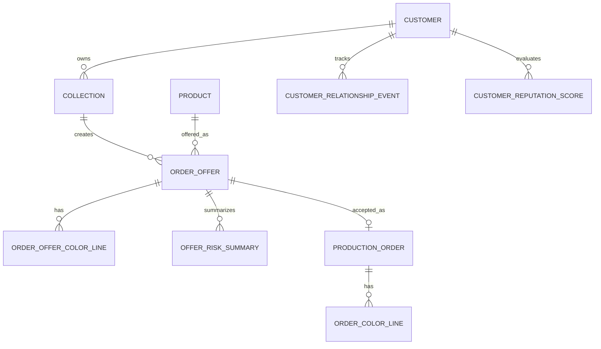

# Sipariş Marketi ve Teklif Fiyatlandırma

## Amaç

Bu doküman oyuncuya sunulacak sanal sipariş pazarını, müşteri ve koleksiyon yapısını, sipariş tekliflerinin hangi verileri taşıyacağını, teklif fiyatının nasıl hesaplanacağını ve ara fırsat siparişlerinin nasıl çalışacağını tanımlar.

Hedef, oyuncuya rastgele ve ruhsuz siparişler göstermek değil; fabrika kapasitesi, müşteri ilişkisi, teslim riski, karlılık ve büyüme hedefleri arasında anlamlı seçimler yaptırmaktır.

## Temel Kararlar

- Siparişler tek tek rastgele ürünler olarak değil, mümkün olduğunca müşteri ve koleksiyon bağlamıyla sunulmalıdır.
- Ana akış: `Customer -> Collection -> Order Offer -> Accepted Production Order`.
- Oyuncu her teklifi kabul edememelidir; kapasite, teslim riski ve strateji seçimi önemli olmalıdır.
- Teklif ekranı sade olmalı, fakat arka planda ürün reçetesi, risk, fiyat, fason ve fabrika uygunluğu hesaplanmalıdır.
- Ara fırsat siparişleri yüksek karlı, az adetli ve kısa karar süreli özel teklifler olarak ayrı bir teklif tipi olmalıdır.
- Ödeme sistemi oyuncuyu yormamalıdır; sevkiyat tamamlandığında ödeme hemen yapılır.
- Oyuncunun sevkiyat performansı güvenilirlik / bilinirlik puanını yükseltir ve daha büyük sipariş adetlerini açar.

## Sipariş Akışı

```text
Customer
  -> Collection
    -> Order Offer
      -> Accepted Production Order
        -> Planning
          -> Shift Simulation
            -> Report
```

Teklif kabul edildiğinde fiyat, teslim tarihi, adet, renk dağılımı, müşteri koşulları ve ceza/bonus bilgileri kilitlenir.

## Müşteri Modeli

Müşteri siparişin kaynağıdır. Her müşterinin karakteri olmalıdır.

Müşteri verileri:

- Müşteri adı.
- Müşteri tipi.
- Tercih ettiği ürün katmanı.
- Fiyat hassasiyeti.
- Kalite beklentisi.
- Teslim hassasiyeti.
- Sipariş sıklığı.
- İlişki seviyesi.
- Gerekli sertifikalar.
- Tercih ettiği ürün kategorileri.
- Ödeme prensibi.
- Risk toleransı.

İlk karar olarak müşteri ödeme riski karmaşıklaştırılmaz. Tüm müşteriler sevkiyat sonrası ödeme yapar. Müşteriler arasındaki fark ödeme gecikmesiyle değil; adet, kalite beklentisi, teslim hassasiyeti, fiyat ve ilişki fırsatlarıyla gösterilir.

Müşteri tipleri:

```text
Budget Retailer
Yüksek adet, düşük fiyat, düşük/orta kalite beklentisi.

Fashion Brand
Koleksiyonlu çalışır, orta-yüksek fiyat verir, kalite ve teslim takibi ister.

Premium Boutique
Az adet, yüksek kar, kalite hassasiyeti yüksek.

Export Buyer
Yüksek adet, sertifika ister, gecikmeye toleransı düşüktür.
```

## Koleksiyon Modeli

Koleksiyon müşterinin dönemsel ürün grubudur. Oyuncu tek bir ürün listesi değil, pazarda yaşayan markalar ve koleksiyonlar görür.

Koleksiyon verileri:

- Koleksiyon adı.
- Müşteri.
- Sezon veya tema.
- İçerdiği ürün kodları.
- Aktif olduğu gün aralığı.
- Minimum fabrika seviyesi.
- Beklenen kalite seviyesi.
- Olası teklif adet aralıkları.

Örnek:

```text
Customer: Urban Loop
Collection: Summer Basics
Products:
  - Manama
  - Cameo
  - Liva
```

## Sipariş Teklifi Modeli

Oyuncunun karar verdiği ana nesne `Order Offer` olmalıdır.

Teklif verileri:

- Teklif ID.
- Müşteri.
- Koleksiyon.
- Ürün kodu.
- Ürün adı.
- Ürün katmanı.
- Teklif tipi.
- Toplam adet.
- Renk dağılımı.
- Teslim tarihi.
- Teklif fiyatı.
- Tahmini kar.
- Kabul için son gün.
- Gerekli operasyonlar.
- Eksik fabrika kabiliyetleri.
- Fason ihtiyacı.
- Teslim riski.
- Kalite riski.
- Gecikme cezası.
- Erken veya kusursuz teslim bonusu.
- Müşteri ilişki etkisi.
- Gerekli güvenilirlik / bilinirlik seviyesi.
- Planlama takvimine etkisi.
- Departman yoğunluk önizlemesi.

Oyuncuya sade gösterim:

```text
Cameo - Baskılı T-Shirt
Urban Loop / Summer Basics
2000 adet
Teslim: Day 12
Teklif: 18.400 USD
Tahmini kar: İyi
Risk: Orta
Not: Baskı için fason gerekli.
```

Teklif ekranı, oyuncuya yeni siparişin üretim takvimine etkisini de göstermelidir. Bu etki departman yoğunluk haritası ve risk mesajlarıyla özetlenir.

## Teklif Türleri

Market farklı karar tipleri sunmalıdır:

- `Safe Order`: Düşük risk, düşük/orta kar.
- `Volume Order`: Yüksek adet, fabrikayı uzun süre doldurur.
- `Rush Order`: Kısa teslim, yüksek fiyat, yüksek stres.
- `Strategic Order`: Karı düşük olabilir, müşteri ilişkisi veya yeni müşteri açar.
- `Premium Opportunity`: Kalite/sertifika ister, yüksek kar verir.
- `Subcontract Heavy Order`: Fason planlaması gerektirir, kar iyi ama risklidir.
- `Ara Fırsat Siparişi`: Az adetli, yüksek karlı, iyi planlamayı ödüllendiren özel teklif.

## Ara Fırsat Siparişleri

Ara fırsat siparişleri oyuncunun iyi planlama yaptığında araya alabileceği yüksek karlı küçük işlerdir.

Bu siparişler şu hissi vermelidir:

```text
Planlamayı iyi yaptım, hatlarımda küçük bir boşluk var.
Bu boşluğu yüksek karlı bir fırsatla değerlendirebilirim.
```

Ara fırsat siparişleri:

- Az adetli olur.
- Normal siparişlere göre daha yüksek birim kar verir.
- Kabul süresi kısa olur.
- Mevcut planı bozarsa riskli hale gelir.
- Oyuncunun boş kapasitesini, hazır kuyruğunu veya uygun operasyon kabiliyetini kullanır.
- Bazen müşteri ilişkisi veya prestij bonusu verir.

Örnek:

```text
Ara Fırsat: Premium Boutique için 180 adet Cameo
Teslim: 3 gün
Teklif: Yüksek kar
Risk: Düşük, çünkü yarın dikim hattında 3 saat boşluk görünüyor
Not: Baskı işlemi hazır fason kontenjanına sığabilir
```

## Ara Fırsat Oluşma Koşulları

Ara fırsatlar tamamen rastgele düşmemelidir. Sistem oyuncunun planını okuyarak anlamlı fırsatlar üretmelidir.

Oluşma koşulları:

- Oyuncunun bazı line'larında boş kapasite tahmini vardır.
- Mevcut siparişlerin teslim riski kontrol altındadır.
- Ara fırsatın gerekli operasyonları oyuncunun mevcut kabiliyetleriyle veya güvenli fasonla yapılabilir.
- Adet düşük olduğu için plan içine sıkıştırılabilir.
- Kabul edildiğinde en az bir karar gerilimi yaratır: kar mı, risk mi?

Ara fırsat verileri:

- Fırsat nedeni.
- Gereken boş kapasite.
- Tahmini plan uyumu.
- Ek kar oranı.
- Kabul süresi.
- Planı bozma riski.
- Gerekli operasyonlar.
- Gerekli fason seçeneği.
- Müşteri ilişki bonusu.

Fırsat nedenleri:

```text
Dikim hattında boşluk var.
Kesim kuyruğun güçlü görünüyor.
Aynı ürün ailesinde hızlı tamamlanabilecek küçük iş var.
Fason baskı kontenjanında boşluk bulundu.
Müşteri acil küçük parti için yüksek fiyat veriyor.
```

## Ara Fırsat Riskleri

Ara fırsat siparişleri bedava para olmamalıdır.

Riskler:

- Mevcut büyük siparişin teslim tarihini sıkıştırabilir.
- Fason gecikirse planı bozabilir.
- Aynı departmanda beklenmeyen yığılma yaratabilir.
- Oyuncu fırsatı yanlış yerde kabul ederse asıl siparişleri riske atabilir.

Oyuncuya gösterilecek sade uyarı:

```text
Bu fırsat karlı, fakat yarınki dikim kapasitenin %18'ini kullanacak.
MDL-FW-1254 zaten riskliyken kabul edersen teslim baskısı artabilir.
```

## Ödeme Prensibi

Finans sistemi oyuncuyu gereksiz tahsilat takibiyle yormamalıdır.

Temel karar:

```text
Sevkiyat tamamlanır.
Ödeme hemen factory cash olarak hesaba geçer.
```

Kısmi sevkiyat varsa ödeme de sevk edilen adet kadar gerçekleşebilir. Bu, oyuncuya büyük siparişlerde ara nakit akışı sağlar.

Örnek:

```text
Sipariş: 5000 adet
Bugün sevk edilen: 1200 adet
Ödeme: 1200 adetlik sevkiyat karşılığı hemen alınır
Kalan ödeme: kalan sevkiyatlara bağlıdır
```

Şimdilik olmamalı:

- Müşteri ödeme gecikmesi.
- Tahsilat riski.
- Vade takibi.
- Alacak finansmanı.
- Karmaşık fatura muhasebesi.

## Güvenilirlik ve Bilinirlik

Oyuncunun sevkiyat performansı uzun vadeli pazar gelişimini belirlemelidir.

İki sade puan kullanılabilir:

- `Güvenilirlik`: Teslim tarihine uyma, kalite, eksiksiz sevkiyat.
- `Bilinirlik`: Daha büyük müşteriler ve daha büyük adetli teklifler tarafından fark edilme.

Bu puanlar şu sonuçları etkiler:

- Daha büyük sipariş adetleri.
- Daha iyi müşteriler.
- Daha değerli koleksiyonlar.
- Premium ve Luxury tekliflerin görünme ihtimali.
- Ara fırsat kalitesi.
- Rush veya özel sipariş erişimi.

Güvenilirliği artıran durumlar:

- Zamanında sevkiyat.
- Erken sevkiyat.
- Eksiksiz teslim.
- Düşük kalite sorunu.
- Aynı müşteriyle başarılı tekrar işler.

Güvenilirliği düşüren durumlar:

- Gecikmeli sevkiyat.
- Eksik teslim.
- Yüksek kalite problemi.
- Kabul edilen siparişi yetiştirememek.

Oyuncu mesajı örneği:

```text
Urban Loop siparişini zamanında tamamladın.
Güvenilirliğin arttı. Bu müşteri yakında daha büyük koleksiyon işleri önerebilir.
```

## Sipariş Adedi Ölçekleme

Oyuncu başlangıçta küçük adetli siparişlerle çalışır. Güvenilirlik, bilinirlik, fabrika kapasitesi ve ürün katmanı arttıkça sipariş adetleri büyür.

Sipariş adedi yalnızca oyuncu puanına göre büyümemelidir. Sistem aynı anda şu koşulları kontrol etmelidir:

- Güvenilirlik / bilinirlik puanı.
- Fabrika kapasitesi.
- Ürün katmanı.
- Gerekli operasyon kabiliyetleri.
- Müşteri tipi.
- Teslim performansı geçmişi.

Örnek ölçek:

```text
Başlangıç Atölye:
Basic: 300 - 500 adet

Gelişen Atölye:
Basic: 800 - 2.000 adet
Premium: 100 - 400 adet

Küçük Fabrika:
Basic: 5.000 - 7.000 adet
Premium: 500 - 1.500 adet
Luxury: 50 - 200 adet

Entegre Tesis:
Basic: 50.000 - 60.000 adet
Premium: 5.000 - 10.000 adet
Luxury: 500 - 2.000 adet
```

Bu değerler balancing sırasında değiştirilebilir. Ana prensip şudur:

```text
Basic ürünlerde adet tavanı yüksek olur.
Premium ürünlerde adet daha kontrollü büyür.
Luxury ürünlerde adet düşük kalır, fakat birim kar çok yüksektir.
```

Bu sistem oyuncuyu yatırıma iter:

```text
Artık 7000 adetlik Basic siparişler gelmeye başladı.
Mevcut kesim ve dikim kapasiten bu adetleri zor karşılıyor.
Yeni line veya yeni departman yatırımı düşünmelisin.
```

## Teklif Fiyatı Hesabı

Teklif fiyatı ürün reçetesinden başlar.

Önerilen hesap:

```text
Planlanan maliyet = malzeme + iç operasyon + fason + kalite + paketleme
Risk payı = planlanan maliyet * risk katsayısı
Kar marjı = ürün katmanı + müşteri tipi + teklif tipi
Teklif fiyatı = planlanan maliyet + risk payı + kar marjı
```

Teklif tipine göre katsayılar:

```text
Safe Order: düşük risk payı, normal kar
Rush Order: yüksek risk payı, yüksek kar
Volume Order: düşük birim kar, yüksek toplam gelir
Ara Fırsat: yüksek birim kar, düşük/orta toplam adet
Strategic Order: düşük kar, ilişki veya yeni pazar bonusu
```

Admin sistemin önerdiği fiyatı görebilmeli ve override edebilmelidir.

## Teslim Tarihi Hesabı

Teslim tarihi tamamen rastgele olmamalıdır.

Önerilen hesap:

```text
Minimum üretim süresi
+ ürün karmaşıklığı
+ adet yükü
+ fason süresi
+ kalite kontrol süresi
+ müşteri aciliyet katsayısı
+ market varyasyonu
= teklif teslim tarihi
```

Örnek minimumlar:

```text
Düz Basic T-Shirt: 4 gün
Baskılı Basic T-Shirt: 8 gün
Premium Hoodie: 12 gün
Luxury Coat: 20 gün
```

Ara fırsat teslim tarihi daha kısa olabilir, fakat adet düşük tutulmalıdır.

## Market Yenilenme Kuralları

Sipariş pazarı canlı hissettirmelidir.

Önerilen kurallar:

- Her gün birkaç yeni teklif gelir.
- Teklifler 1-3 gün geçerli olabilir.
- Oyuncu hepsini kabul edemez.
- Müşteri ilişkisi iyi olan müşterilerden daha iyi teklifler gelebilir.
- Güvenilirlik ve bilinirlik arttıkça daha büyük adetli teklifler açılır.
- Fabrika kabiliyetleri arttıkça daha değerli teklifler açılır.
- Ara fırsatlar her gün garanti gelmez; planlama başarısı ve pazar şansı ile gelir.

Örnek günlük market:

```text
3 normal sipariş
1 rush sipariş
1 koleksiyon siparişi
0 veya 1 ara fırsat siparişi
```

## Oyuncuya Gösterilecek Karar Sinyalleri

Teklif ekranı fazla teknik olmamalıdır.

Gösterilecek ana sinyaller:

- Kar potansiyeli.
- Teslim riski.
- Fabrika uygunluğu.
- Eksik kabiliyet.
- Fason ihtiyacı.
- Müşteri değeri.
- Plan uyumu.
- Takvim etkisi.
- Güvenilirlik etkisi.

Örnek:

```text
Kar: Yüksek
Risk: Orta
Eksik: Baskı makinesi
Çözüm: Fason baskı gerekir
Plan Uyumu: Zor ama mümkün
Takvim Etkisi: Day 10 Ütü kırmızı
Müşteri: İlişki geliştirilebilir
Güvenilirlik: Başarılı teslim büyük siparişleri açabilir
```

Ara fırsat sade gösterim:

```text
Ara Fırsat
180 adet Cameo
Yüksek kar
Plan uyumu: İyi
Yarınki boş dikim kapasiteni değerlendirebilir.
```

## Kabul Sonrası Dönüşüm

Oyuncu teklifi kabul ettiğinde:

- Teklif `Accepted Production Order` haline gelir.
- Fiyat, adet, renkler ve teslim tarihi kilitlenir.
- Gerekli fason kararları planlama ekranına taşınır.
- Sipariş aktif üretim emirleri listesine eklenir.
- Müşteri ilişki hedefleri takip edilmeye başlar.

```text
Order Offer -> Accepted Production Order -> Line Assignment -> Shift Simulation
```

## ER Taslağı

Bu taslak kavramsal ilişkiyi gösterir.



## Örnekler

Normal teklif:

```text
Customer: Urban Loop
Collection: Summer Basics
Product: Cameo
Quantity: 2000
Colors: Siyah 1000, Lacivert 300, Kırmızı 400, Camel 300
Due Date: Day 12
Offer Price: 18.400 USD
Risk: Orta
Note: Baskı için fason gerekli.
```

Rush teklif:

```text
Customer: FastModa
Product: Manama
Quantity: 900
Due Date: Day 5
Offer Price: Yüksek
Risk: Yüksek
Note: Teslim tarihi sıkışık, fakat fiyat iyi.
```

Ara fırsat:

```text
Customer: Premium Boutique
Product: Cameo
Quantity: 180
Due Date: Day 3
Offer Price: Çok iyi
Risk: Orta
Reason: Yarın dikim hattında boşluk var.
Note: Büyük siparişleri riske atmadan araya alınabilir.
```

Büyük sipariş açılımı:

```text
Customer: Urban Loop
Product: Manama
Quantity: 7000
Due Date: Day 18
Reason: Son 3 sevkiyatı zamanında tamamladın.
Note: Bu adet mevcut kapasiteni zorlayabilir; yeni line yatırımı önerilir.
```

## İleride Genişletilecek Alanlar

- Müşteri sadakati ve seviye sistemi.
- Güvenilirlik / bilinirlik puan sistemi.
- Koleksiyon tamamlama bonusları.
- Sipariş kaçırma etkisi.
- Pazarlık sistemi.
- Teklif karşılaştırma ekranı.
- Ara fırsat öneri motoru.
- Pazar trendleri.
- Müşteri bazlı özel sertifika talepleri.
- Geç teslim cezası ve erken teslim bonusu.
