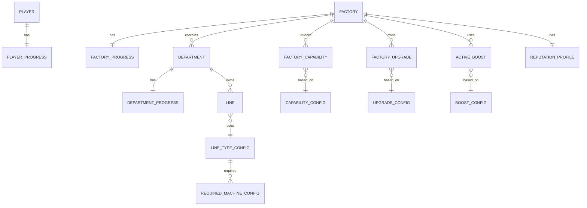

# Fabrika Kapasite, Yatırım ve Büyüme Sistemi

## Amaç

Bu doküman Factory Runway'de oyuncunun nasıl seviye atlayacağını, fabrikanın nasıl büyüyeceğini, departmanların nasıl gelişeceğini, line ve makine config yapısının nasıl kurulacağını ve boost sisteminin hangi sınırlar içinde çalışacağını tanımlar.

Ana hedef, tek bir level ile her şeyi açan düz bir yapı yerine, oyuncunun atölyeden entegre tesise dönüşümünü çok katmanlı ama anlaşılır bir ilerleme sistemiyle vermektir.

## Temel Kararlar

- Tek level sistemi kullanılmaz.
- Oyuncu ilerlemesi, fabrika büyümesi, departman gelişimi, kabiliyet açılımları ve itibar ayrı katmanlardır.
- Kapasite artışı sadece yeni line açmak değildir; yeni makine, yeni departman, yeni operasyon kabiliyeti, kalite sistemi ve altyapı yatırımı da büyümenin parçasıdır.
- Line, makine, personel, kapasite ve upgrade etkileri config / database üzerinden yönetilebilir olmalıdır.
- Boost sistemi kalıcı yatırımlar ve geçici destekler olarak ikiye ayrılmalıdır.
- Reklam veya oyun içi ödeme ile verilebilecek fırsatlar agresif pay-to-win olmamalı; geçici, sınırlı ve oyuncunun kararını destekleyen seçenekler olmalıdır.

## Progression Katmanları

Önerilen ana yapı:

```text
Player Level
Factory Level
Department Level
Capability Unlock
Machine / Equipment Config
Reputation
Boost System
```

Bu katmanların sorumlulukları ayrıdır:

- `Player Level`: Genel oyun ilerlemesi ve yeni sistemlerin açılması.
- `Factory Level`: Fiziksel büyüme, alan, slot, maksimum line ve tesis sınırları.
- `Department Level`: Her departmanın kapasite, verimlilik ve risk gelişimi.
- `Capability Unlock`: Baskı, nakış, boya, yıkama, kalite kontrol, kumaş üretimi gibi yeni kabiliyetler.
- `Machine / Equipment Config`: Her line veya departmanın ihtiyaç duyduğu makine, personel ve kapasite etkileri.
- `Reputation`: Güvenilirlik / bilinirlik ile daha büyük ve daha değerli siparişlere erişim.
- `Boost System`: Geçici veya kalıcı avantajlar.

## Player Level

Player Level oyuncunun genel oyun yolculuğunu temsil eder. Doğrudan üretim kapasitesi vermek yerine yeni sistemleri, rehberliği ve pazar görünürlüğünü açmalıdır.

XP kaynakları:

- Başarılı sevkiyat.
- Zamanında teslim.
- Erken teslim.
- Ürün zorluğuna göre üretim tamamlama.
- `valueAddCategory` yüksek ürünleri başarıyla yönetme.
- Ara fırsat siparişi tamamlama.
- İlk kez yeni ürün üretme.
- Müşteri ilişkisi geliştirme.
- Darboğazı çözme.
- Yeni kabiliyet yatırımı yapma.
- Fason bağımlılığını azaltan yatırım yapma.

Player Level açılımları:

- Yeni ekranlar.
- Yeni müşteri tipleri.
- Yeni teklif türleri.
- Yeni tutorial / görev zincirleri.
- Yeni pazar fırsatları.
- Yeni ürün katmanı görünürlüğü.
- Daha gelişmiş raporlar.

Örnek:

```text
Player Level 2: Ara Fırsat Siparişleri açılır.
Player Level 3: Basit fason teklif karşılaştırması açılır.
Player Level 5: Premium ürün teklifleri görünmeye başlar.
```

### XP ve Progression Puanlama Prensibi

Player Level sadece üretilen adede göre yükselmemelidir. Oyuncu çok kolay ve düşük karlı ürünleri yüksek adetle üreterek tüm progression sistemini aşamamalıdır.

XP / progression puanı şu metriklerle ağırlıklandırılmalıdır:

- Ürün katmanı: `Basic`, `Premium`, `Luxury`.
- Katma değer kategorisi: `valueAddCategory`.
- Üretim zorluğu.
- Operasyon sayısı.
- Kalite / sertifika gereksinimi.
- Teslim performansı.
- Ara fırsat veya rush sipariş başarısı.
- Darboğaz çözme etkisi.
- Stratejik yatırım etkisi.

Örnek katsayılar:

```text
Basic plain: 1.0x
Basic printed / embroidered: 1.3x - 1.5x
Premium standard: 2.0x
Premium certified: 2.3x
Luxury detail: 3.0x+
```

Basit formül taslağı:

```text
progressionPoints =
completedQuantity
* productDifficultyScore
* tierMultiplier
* valueAddMultiplier
* deliveryPerformanceMultiplier
```

Denge notları:

- Factory cash üretim adedinden güçlü şekilde etkilenebilir.
- Player Level puanı üretim adedinden etkilenmeli, fakat ürün zorluğu ve katma değerle dengelenmelidir.
- Düşük zorluklu ürünlerde günlük veya sipariş bazlı diminishing return uygulanabilir.
- Yeni ürün, yeni operasyon ve yeni capability denemeleri ekstra tecrübe hissi verebilir.

Yatırımlardan kazanılabilecek puanlar:

- Yeni line açma.
- Yeni capability unlock.
- Baskı, nakış, boya gibi katma değer operasyonlarını fabrika içine alma.
- Darboğazı çözen kapasite yatırımı.
- Ütü / paket gibi final aşamalarda nakit akışını hızlandıran yatırım.
- Premium / Luxury üretime hazırlık sağlayan kalite yatırımı.

## Factory Level

Factory Level fabrikanın fiziksel ve altyapısal büyüklüğünü temsil eder.

Factory Level kaynakları:

- Factory cash yatırımı.
- Belirli sayıda başarılı sipariş.
- Belirli güvenilirlik / bilinirlik seviyesi.
- Belirli departman seviyeleri.
- Yeni kabiliyet yatırımları.

Factory Level etkileri:

- Maksimum line sayısı.
- Departman slotları.
- Haritada açılabilecek departman zone'ları.
- Zone başına visible / unlockable line slot sayısı.
- Makine slotları.
- Personel kapasitesi.
- Depo kapasitesi.
- Sevkiyat kapasitesi.
- Yeni tesis alanları.
- Daha büyük sipariş adetleri için uygunluk.

Fabrika haritası, zone ve slotların görsel davranışı için:

```text
20-factory-layout-system.md
```

Slot açma, line kurma ve upgrade maliyet formülleri için:

```text
22-factory-expansion-math.md
```

Örnek seviye tablosu:

```text
Factory Level 1 - Atölye
- 2 sewing line
- 1 cutting area
- 1 ironing area
- 1 packing area
- Temel sevkiyat
- Baskı / nakış yok

Factory Level 2 - Gelişen Atölye
- 4 sewing line
- Daha büyük depo
- Basit baskı makinesi slotu
- Basit kalite kontrol alanı

Factory Level 3 - Küçük Fabrika
- 8 sewing line
- Baskı ve nakış departmanı
- Kalite kontrol departmanı
- Daha yüksek sevkiyat kapasitesi

Factory Level 4 - Fabrika
- 16 sewing line
- Boya / Yıkama alanı
- Gelişmiş kalite güvence
- Premium siparişlere daha uygun yapı

Factory Level 5 - Entegre Tesis
- Kumaş hazırlık / kumaş üretimi
- Büyük adetli siparişlere uygun altyapı
- Luxury üretim için gelişmiş tesis koşulları
```

## Department Level

Departman seviyesi gerçek üretim performansının ana kaynaklarından biridir.

Departman örnekleri:

- Depo.
- Kesim.
- Dikim.
- Ütü.
- Paket.
- Sevkiyat.
- Baskı.
- Nakış.
- Kalite kontrol.
- Kumaş hazırlık.
- Kumaş üretim.

Departman level etkileri:

- Kapasite artışı.
- Verimlilik artışı.
- Bekleme riskinin azalması.
- Kalite riskinin azalması.
- Yeni line veya makine slotu.
- Personel kapasitesi.
- Premium / Luxury uygunluğu.

Örnek:

```text
Dikim Level 1
- 2 line slotu
- Base efficiency: %85
- Basic ürünlere uygun

Dikim Level 2
- 4 line slotu
- Efficiency +5%
- Daha karmaşık Basic ürünlere uygun

Dikim Level 3
- 8 line slotu
- Efficiency +10%
- Premium ürünlerde kalite riski azalır
```

## Capability Unlock

Capability, fabrikanın yapabildiği yeni operasyon türüdür. Oyuncunun fasona bağımlılığını azaltır ve daha katma değerli ürünleri içeride üretmesini sağlar.

Kabiliyet örnekleri:

- Baskı.
- Nakış.
- Boya.
- Yıkama.
- Özel paketleme.
- Kalite kontrol.
- Kalite güvence.
- Kumaş hazırlık.
- Kumaş üretim.

Kabiliyet açma etkileri:

- Fason maliyeti azalır.
- Fason teslim riski azalır.
- Üretim süresi daha kontrol edilebilir hale gelir.
- Daha değerli ürün reçeteleri açılır.
- Premium / Luxury siparişlere erişim artar.

Örnek:

```text
Baskı Kabiliyeti Açıldı
- Baskı operasyonu artık fabrika içinde yapılabilir.
- Fason baskı yerine dakika/adet üretim süresi kullanılır.
- Baskılı Basic ürünlerde kar marjı artabilir.
```

## Machine / Equipment Config

Her line ve departman kendi makine / personel / kapasite config'ine sahip olmalıdır.

Makine ve teknoloji sistemi yalnızca yeni line satın alma üzerine kurulmaz. Oyuncu aynı kapasite problemini iki farklı yoldan çözebilmelidir:

- Yatay büyüme: Yeni line / slot açmak.
- Dikey büyüme: Mevcut line veya departman parkurunu teknoloji yatırımıyla güçlendirmek.

Yatay büyüme daha fazla alan, personel ve yönetim karmaşıklığı ister. Dikey büyüme daha pahalı olabilir, fakat aynı alandan daha yüksek çıktı, daha düşük fire, daha düşük personel ihtiyacı veya daha yüksek ürün katmanı uygunluğu sağlar.

Line config alanları:

- Line tipi.
- Desteklediği operasyonlar.
- Gerekli departman.
- Gerekli personel.
- Gerekli makineler.
- Base efficiency.
- Kapasite etkisi.
- Kurulum maliyeti.
- Bakım maliyeti.
- Gereken factory level.
- Gereken department level.
- Gereken alan / slot.
- Teknoloji seviyesi.
- Ürün katmanı uygunluğu.
- Fire etkisi.
- Personel azaltma etkisi.
- Enerji / bakım maliyeti etkisi.

Örnek sewing line config:

```text
Line Type: Sewing Line
Supported Operation: Sewing
Required Department: Dikim
Required Staff: 10
Required Machines:
  - Sewing Machine: 8
  - Overlock Machine: 1
  - Coverstitch Machine: 1
Base Efficiency: %85
Capacity Formula: shiftMinutes * efficiency / productSewingMinutes
Install Cost: 12.000 Factory Cash
Required Factory Level: 1
Required Department Level: 1
Spare Machine Support: true
```

Örnek cutting area config:

```text
Department: Kesim
Level: 1
Required Staff: 2
Required Equipment:
  - Cutting Table: 1
  - Manual Cutter: 1
Capacity Modifier: 1.0
Install Cost: 5.000 Factory Cash
```

Örnek baskı makinesi config:

```text
Machine: Basic Print Machine
Supported Operation: Printing
Required Department: Baskı
Required Staff: 2
Production Time: 1.2 dakika / adet
Quality Risk Modifier: Medium
Install Cost: 25.000 Factory Cash
Required Factory Level: 2
```

Yedek makine yatırımları line verimliliğini doğrudan büyütmekten çok arıza etkisini azaltır:

```text
Spare Sewing Machine
Effect: Makine arızasında duruş süresi -50%
Use Case: Büyük siparişlerde teslim riskini düşürür
```

## Line Technology Progression

Her departmanda technology progression, oyuncunun basic üretimden Premium ve Luxury üretime geçişini desteklemelidir. Seviye artışı yalnızca "daha hızlı üretim" olmamalıdır; hız, fire, kalite, personel, bakım ve ürün katmanı uygunluğu birlikte değişmelidir.

Önerilen teknoloji etkileri:

- `speedModifier`: Ürün reçetesindeki standart süreyi çarpar.
- `wasteRateModifier`: Fire oranını azaltır veya artırır.
- `qualityModifier`: Kalite riskini azaltır.
- `staffRequiredModifier`: Gerekli personel sayısını değiştirir.
- `maintenanceCostModifier`: Bakım maliyeti ve bakım riski etkisini değiştirir.
- `energyCostModifier`: Daha gelişmiş ekipmanın enerji maliyetini temsil eder.
- `maxProductTier`: Line'ın güvenli üretebileceği maksimum ürün katmanı.

Örnek kesim progression:

```text
Kesim Level 1 - Manuel Kesim Masası
- Manuel kumaş serme
- El motoru ile kesim
- speedModifier: 1.00
- wasteRate: %6
- requiredStaff: 4
- maxProductTier: Basic

Kesim Level 2 - Otomatik Serim + Manuel Kesim
- Serim otomatik
- Kesim el motoru ile devam eder
- speedModifier: 0.82
- wasteRate: %4.5
- requiredStaff: 3
- maxProductTier: Basic / Standard

Kesim Level 3 - Otomatik Serim + Otomatik Kesim
- Serim ve kesim otomatik
- speedModifier: 0.62
- wasteRate: %3
- requiredStaff: 2
- maxProductTier: Premium

Kesim Level 4 - Serim + Kesim + Lazer İşaretleme
- Daha hassas işaretleme ve daha az fire
- speedModifier: 0.48
- wasteRate: %1.8
- requiredStaff: 2
- maxProductTier: Luxury
```

Örnek dikim progression:

```text
Dikim Level 1 - Bağımsız Makine Parkuru
- İş dağılımı ve yarı mamul taşıma insanlar tarafından yapılır
- Yüksek WIP ve bekleme riski
- speedModifier: 1.00
- requiredStaff: 10
- maxProductTier: Basic

Dikim Level 2 - Bantlı Dikim Hattı
- Ürünler makineler arasında konveyör / bant ile akar
- Bekleme ve taşıma kaybı azalır
- speedModifier: 0.86
- requiredStaff: 10
- maxProductTier: Basic / Premium

Dikim Level 3 - Modüler Hat + Operasyon Dengeleme
- Darboğaz operasyonlar daha iyi dengelenir
- speedModifier: 0.74
- requiredStaff: 9
- qualityModifier: +%
- maxProductTier: Premium

Dikim Level 4 - Akıllı Hat İzleme
- Hat verisi, kalite hatası ve darboğaz erken görünür
- speedModifier: 0.66
- requiredStaff: 8
- qualityModifier: ++
- maxProductTier: Luxury
```

Örnek ütü / paket progression:

```text
Ütü/Paket Level 1 - El Ütüsü + Manuel Paket
- Ütü ve paketleme insan ağırlıklıdır
- speedModifier: 1.00
- requiredStaff: 5

Ütü/Paket Level 2 - Konveyör Ütü + Manuel Paket
- Ütü akışı hızlanır, paketleme manuel kalır
- speedModifier: 0.78
- requiredStaff: 4

Ütü/Paket Level 3 - Konveyör Ütü + Yarı Otomatik Paket
- Ütü sonrası biriktirme ve paket akışı iyileşir
- speedModifier: 0.62
- requiredStaff: 3

Ütü/Paket Level 4 - Konveyör Ütü + Otomatik Paketleme
- Daha yüksek adet ve daha tutarlı paket kalitesi
- speedModifier: 0.48
- requiredStaff: 2
- maxProductTier: Premium / Luxury
```

Örnek nakış progression:

```text
Nakış Level 1 - 10 Kafa Nakış Makinesi
- Aynı anda 10 parçaya nakış yapabilir

Nakış Level 2 - 20 Kafa Nakış Makinesi
- Aynı alanda daha yüksek batch kapasitesi

Nakış Level 3 - Çok Kafa + Otomatik Renk / İplik İzleme
- Daha az duruş ve daha düşük hata riski
```

Balans prensibi:

- Daha gelişmiş teknoloji her zaman toplamda iyi olmalı, fakat bedelsiz olmamalıdır.
- Hız ve kalite artarken bakım, enerji veya kurulum maliyeti de artabilir.
- Oyuncu bazı aşamalarda "yeni line mı, mevcut line upgrade mi?" kararını gerçekten tartmalıdır.
- Premium / Luxury ürünlere geçiş sadece sipariş açılımıyla değil, uygun teknoloji, kalite ve tesis yatırımlarıyla mümkün olmalıdır.

## Upgrade Türleri

Upgrade'ler beş ana sınıfta düşünülmelidir:

- `Capacity Upgrade`: Daha fazla adet çıkarır.
- `Efficiency Upgrade`: Aynı kaynakla daha hızlı üretir.
- `Capability Upgrade`: Yeni operasyon açar.
- `Quality Upgrade`: Kalite riskini azaltır, Premium / Luxury üretimi destekler.
- `Infrastructure Upgrade`: Daha fazla line, personel, makine, depo veya sevkiyat kapasitesi açar.

Örnek:

```text
Upgrade: Kesim Masası Genişletme
Type: Capacity Upgrade
Effect: Kesim kapasitesi +15%
Cost: 8.000 Factory Cash
Required Factory Level: 1
```

```text
Upgrade: Kalite Kontrol Alanı
Type: Quality Upgrade
Effect: Premium ürünlerde kalite riski azalır
Cost: 18.000 Factory Cash
Required Factory Level: 2
```

## Boost Sistemi

Boost sistemi ikiye ayrılır:

- Kalıcı boost.
- Geçici boost.

Kalıcı boost örnekleri:

- Yeni line.
- Yeni makine.
- Departman level up.
- Sertifika.
- Kalite sistemi.
- Personel eğitimi.
- Yeni tesis alanı.

Geçici boost örnekleri:

- Ek mesai.
- Acil bakım.
- Vardiya motivasyonu.
- Hızlandırılmış fason.
- Kısa süreli verimlilik artışı.
- Darboğaz çözme desteği.

Geçici boost'lar kriz yönetimi ve taktik karar üretmelidir. Ana büyüme kalıcı yatırımlardan gelmelidir.

## Reklam ve Oyun İçi Ödeme Fırsatları

Reklam veya oyun içi ödeme seçenekleri dengeli kullanılmalıdır. Amaç oyuncuya zorla para harcatmak değil, isteğe bağlı kolaylık ve hızlandırma sunmaktır.

Olabilir:

- Reklam izleyerek küçük factory cash bonusu.
- Reklam izleyerek günlük küçük bakım indirimi.
- Reklam izleyerek bir ara fırsat teklifini yeniden değerlendirme.
- Küçük ödeme ile kozmetik fabrika teması.
- Küçük ödeme ile ekstra rapor görünümü veya planlama kolaylığı.
- Sınırlı süreli geçici verimlilik boost'u.
- Hızlandırılmış fason teklifi için opsiyonel destek.

Olmamalı:

- Para ödeyen oyuncunun temel üretim matematiğini kalıcı şekilde ezmesi.
- Zorunlu ödeme duvarı.
- Teslim tarihi krizini çözemeyen oyuncuya agresif satın alma baskısı.
- Premium / Luxury üretimi sadece ödeme ile açmak.
- Reklam izlemeden ilerleyememe.

Doğru kullanım örneği:

```text
Bugün küçük bir bakım bonusu alabilirsin.
Reklam izlersen bir sonraki vardiyada makine arıza riski az miktarda düşer.
```

Sınır:

```text
Boost yardımcı olur, fakat kötü planlamayı tamamen silmez.
Kalıcı rekabet gücü yatırım, kapasite ve doğru kararlarla kazanılır.
```

## Reputation ile Bağlantı

Güvenilirlik ve bilinirlik level değildir, fakat teklif pazarını etkileyen önemli ilerleme puanlarıdır.

Etkileri:

- Daha büyük adetli siparişler.
- Daha iyi müşteriler.
- Daha değerli koleksiyonlar.
- Daha kaliteli ara fırsatlar.
- Rush ve özel siparişlere erişim.

Fabrika kapasitesi yetersizse yüksek itibar bile risk doğurur:

```text
Pazar artık senden 7000 adetlik siparişler bekliyor.
Mevcut dikim kapasiten bu adetler için zayıf kalıyor.
Yeni line veya verimlilik yatırımı önerilir.
```

## Sipariş Adedi ve Yatırım Baskısı

Sipariş adetleri güvenilirlik, bilinirlik, fabrika level ve ürün katmanına göre büyür.

Örnek:

```text
Atölye:
Basic: 300 - 500 adet

Gelişen Atölye:
Basic: 800 - 2.000 adet
Premium: 100 - 400 adet

Küçük Fabrika:
Basic: 5.000 - 7.000 adet
Premium: 500 - 1.500 adet
Luxury: 50 - 200 adet

Entegre Tesis:
Basic: 50.000 - 60.000 adet
Premium: 5.000 - 10.000 adet
Luxury: 500 - 2.000 adet
```

Bu büyüme oyuncuyu doğal olarak yatırıma iter:

- Daha fazla sewing line.
- Daha güçlü kesim kapasitesi.
- Daha hızlı paketleme.
- Daha büyük depo.
- Daha güçlü sevkiyat.
- Fason yerine iç operasyon.
- Kalite sistemi.

## MVP Kapsamı

İlk beta için sade tutulmalıdır:

- Player Level.
- Factory Level.
- Basit departman level mantığı.
- Yeni sewing line açma.
- En az bir kapasite upgrade'i.
- En az bir capability unlock hedefi: örneğin baskı.
- Basit boost mantığı: ek mesai veya bakım bonusu.
- Güvenilirlik ile daha büyük sipariş görünürlüğü.

MVP'de şimdilik derinleştirilmemeli:

- Çok detaylı enerji / alan mikro yönetimi.
- Çok sayıda makine alt türü.
- Karmaşık personel uzmanlığı.
- Agresif ödeme / reklam zorlaması.
- Tam kapsamlı bakım ekonomisi.

## ER Taslağı

Bu taslak kavramsal ilişkiyi gösterir.



## Örnek Config Taslağı

```text
upgradeId: sewing_line_03
name: 3. Dikim Line
type: Capacity Upgrade
requiredFactoryLevel: 2
requiredDepartmentLevel: 2
cost: 18.000 Factory Cash
effects:
  - addLineSlot: Sewing
  - maxSewingLines: +1
requirements:
  - staff: 10
  - machines:
      Sewing Machine: 8
      Overlock Machine: 1
      Coverstitch Machine: 1
```

```text
boostId: emergency_maintenance
name: Acil Bakım
type: Temporary Boost
duration: 1 shift
effect:
  - machineBreakdownRisk: -20%
cost:
  - factoryCash: 500
optionalAdAlternative: true
limits:
  - maxUsesPerDay: 1
```

## İleride Genişletilecek Alanlar

- Admin balancing paneli.
- Makine bakım seviyesi.
- Yedek makine havuzu.
- Personel eğitimi.
- Alan / bina genişletme.
- Enerji kapasitesi.
- Sertifika yatırımları.
- Departman bazlı uzmanlık.
- Sektöre özel makineler.
- Kozmetik fabrika temaları.
- Reklam ve ödeme seçenekleri için etik sınır testleri.
