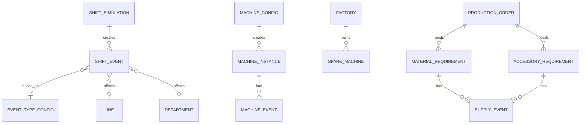

# Vardiya Olayları, Risk ve Kriz Sistemi

## Amaç

Bu doküman Factory Runway'de tek vardiya üretim matematiğini, GameTime kullanımını, personel eksikliği, makine arızası, yedek makine, kumaş ve aksesuar tedarik süreleri gibi üretimi dinamik hale getiren riskleri tanımlar.

Amaç her gün aynı kusursuz matematiğin çalışmasını engellemek, fakat oyuncuyu sürekli cezalandıran yorucu bir sistem de kurmamaktır. Oyuncu iyi planlama yaptığında riskleri yönetebilmeli, kötü planlama yaptığında ise bunun etkisini üretim akışında görmelidir.

## Temel Kararlar

- Oyun realtime idle olmayacaktır.
- Simülasyon `GameTime` ile çalışır.
- Üretim tek vardiya üzerinden planlanır.
- Vardiya matematiği için ana süre `540 GameTime dakikası` kabul edilir.
- Oyuncu vardiyayı elle başlatır.
- Vardiya başladıktan sonra ana plan kilitlenir, sistem sonucu backend tarafında hesaplar.
- Olaylar tamamen rastgele değil, ürün reçetesi, fabrika durumu, risk profili ve oyuncu kararlarına göre ağırlıklı oluşmalıdır.
- Olaylar oyuncuya aksiyon alanı bırakmalıdır.

Not:

```text
08:00 - 17:00 aralığı 540 dakikalık oyun penceresidir.
Aktif çalışma verimi mola, bekleme, personel ve makine etkileriyle ayrıca dengelenir.
```

## Vardiya Matematiği

Temel vardiya:

```text
Shift Start: 08:00
Shift End: 17:00
Shift GameTime Minutes: 540
```

Temel üretim formülü:

```text
Üretim = Kullanılabilir Dakika * Line Verimliliği / Ürün Operasyon Süresi
```

Dikim örneği:

```text
Shift Minutes: 540
Line Efficiency: %85
Product Sewing Time: 8 dk/adet

Üretim:
540 * 0.85 / 8 = 57 adet
```

Olaylar bu matematiği etkiler:

```text
Kullanılabilir Dakika = 540 - bekleme - arıza - malzeme eksikliği - personel etkisi
```

## GameTime ve Simülasyon

Frontend oyuncuya 2-3 dakikalık hızlandırılmış izleme hissi verebilir. Ancak hesaplama GameTime üzerinden yapılır.

Örnek:

```text
Gerçek oyuncu süresi: 2-3 dakika
Oyun vardiyası: 540 GameTime dakikası
```

Backend simülasyon sonucu kesin kaynaktır:

- Üretim adedi.
- Bekleme süreleri.
- Kuyruk değişimleri.
- Olay etkileri.
- Fason / tedarik dönüşleri.
- Gün sonu raporu.

## Olay Kategorileri

Vardiya içinde veya gün başı planlama sırasında etkili olabilecek olay türleri:

- Personel eksikliği.
- Makine arızası.
- Yedek makine kullanımı.
- Kumaş tedarik gecikmesi.
- Aksesuar tedarik gecikmesi.
- Fason gecikmesi.
- Kalite problemi.
- Departman darboğazı.
- Kuyruk yetersizliği.
- Kısa süreli verimlilik düşüşü.

Her olay şu verileri taşımalıdır:

- Olay tipi.
- Etkilenen departman / line / operasyon.
- Olasılık.
- Etki süresi.
- Kapasite etkisi.
- Risk seviyesi.
- Oyuncu aksiyon seçenekleri.
- Rapor mesajı.

## Personel Eksikliği Modeli

Personel eksikliği fabrika büyüklüğüne göre farklı davranmalıdır. Küçük atölyede 1 kişinin eksikliği çok büyük etki yaratırken, büyük fabrikada etki daha yayılır.

Önerilen personel bantları:

```text
0 - 50 Personel:
Eksik personel etkisi yüksek.
Bir kişinin yokluğu line performansını ciddi etkileyebilir.

51 - 80 Personel:
Eksik personel etkisi orta.
Bazı departmanlarda geçici kapasite düşüşü olur.

81 - 120 Personel:
Eksik personel etkisi daha dağıtılmış.
Yedek personel veya departman kaydırma ile etki azaltılabilir.

120+ Personel:
Daha gelişmiş personel planlama ve yedek ekip mantığı devreye girebilir.
```

Personel olay nedenleri:

- Hastalık.
- İzin.
- Geç kalma.
- Eğitim eksikliği.
- Departman içi geçici yoğunluk.

Örnek etkiler:

```text
Küçük Atölye:
1 dikim personeli eksik -> Line verimliliği -10%

Gelişen Atölye:
3 personel eksik -> İlgili departman verimliliği -8%

Küçük Fabrika:
5 personel eksik -> Yedek ekip varsa etki -3%, yoksa -7%
```

Oyuncu aksiyonları:

- Ek mesai.
- Geçici personel kaydırma.
- Vardiya motivasyon boost'u.
- Riskli line yerine güvenli siparişe öncelik verme.
- Personel eğitim / yedek ekip yatırımı.

Oyuncu mesajı:

```text
Bugün dikim ekibinden 2 kişi eksik.
Line 1 ve Line 2 verimliliği düşebilir. Ek mesai veya personel kaydırma düşünebilirsin.
```

## Makine Arızası Modeli

Makine arızaları üretimi canlı hissettirmelidir. Arıza sıklığı makine tipi, bakım seviyesi, yaş ve kullanım yoğunluğuna göre config üzerinden belirlenmelidir.

Makine risk verileri:

- Base arıza olasılığı.
- Kullanım yoğunluğu etkisi.
- Bakım seviyesi etkisi.
- Makine yaşı etkisi.
- Yedek makine var mı?
- Arıza süresi aralığı.
- Kapasite etkisi.

Örnek:

```text
Machine: Sewing Machine
Base Breakdown Risk: Düşük
High Usage Modifier: +Orta
Maintenance Level: İyi ise risk azalır
Breakdown Duration: 30 - 120 GameTime dakika
```

Arıza etkileri:

- Line tamamen durabilir.
- Line verimliliği düşebilir.
- Sadece belirli operasyon yavaşlayabilir.
- Yedek makine varsa duruş süresi azalabilir.

Oyuncu mesajı:

```text
Line 2'de makine arızası yaşandı.
Yedek makine olmadığı için line 60 dakika düşük kapasite çalışacak.
```

## Yedek Makine ve Bakım Yatırımı

Yedek makine yatırımı doğrudan üretim kapasitesini büyütmekten çok üretim güvenliğini artırmalıdır.

Yedek makine etkileri:

- Arıza süresini azaltır.
- Line'ın tamamen durmasını engeller.
- Büyük siparişlerde teslim riskini düşürür.
- Güvenilirlik performansını korumaya yardımcı olur.

Örnek:

```text
Yedek Sewing Machine yatırımı:
- Makine arızasında duruş süresi -50%
- Line tamamen durmak yerine %70 kapasiteyle çalışabilir
- Bakım maliyeti az miktarda artar
```

Bakım boost'u:

```text
Acil Bakım
Süre: 1 vardiya
Etki: Makine arıza riski -20%
Kullanım: Günde 1 kez
```

## Kumaş İhtiyacı ve Tedarik Süresi

Bazı siparişlerde kumaş hazır olabilir. Bazılarında kumaş tedarik süresi ürün kartı veya sipariş teklifi üzerinden belirlenir.

Kumaş tedariki basit tutulmalıdır. Tedarikçi şirket, renk bazlı kumaş ayrımı veya detaylı kumaş stok sistemi şimdilik kullanılmaz.

Kumaş tedarik verileri:

- Kumaş hazır mı?
- Ürün başı kumaş ihtiyacı.
- Toplam kumaş ihtiyacı.
- Tedarik süresi.
- Metre fiyatı.
- Toplam kumaş maliyeti.
- Gecikme riski.
- Kesim için bloklayıcı mı?

Örnek süreler:

```text
Hazır kumaş: 1 gün
Standart kumaş: 5 gün
Özel kumaş: 10 gün
```

Kural:

```text
Kumaş gelmeden kesim başlayamaz.
Kumaş depoya girdiği gün kesime hazır sayılır.
```

Basit hesap:

```text
Cameo - 2000 adet
Ürün başı kumaş ihtiyacı: 0.12 metre
Toplam kumaş ihtiyacı: 240 metre
Kumaş tedarik süresi: 5 gün
Metre fiyatı: 3.20 USD
```

Oyuncu mesajı:

```text
Bu sipariş için 240 metre kumaş gerekiyor.
Kumaş 5 günde hazır olacak. Kumaş gelmeden kesim başlayamaz.
```

## Aksesuar Tedarik Süresi

Aksesuarlar ürün reçetesinde tanımlanmalıdır.

Aksesuar örnekleri:

- Düğme.
- Fermuar.
- Çıtçıt.
- Etiket.
- Askı ipi.
- Özel paket aksesuarı.

Aksesuar tedarik verileri:

- Aksesuar tipi.
- Gerekli adet.
- Tedarik süresi.
- Gecikme riski.
- Hangi operasyonu blokladığı.

Örnek süreler:

```text
Hazır etiket: 1 gün
Standart düğme: 5 gün
Özel fermuar: 10 gün
```

Kural:

```text
Aksesuar eksikse ilgili operasyon tamamlanamaz.
```

Örnek:

```text
Fermuar eksikse fermuarlı ürünün dikimi tamamlanamaz.
Etiket eksikse paket veya final hazırlık aşaması bloklanabilir.
```

Oyuncu mesajı:

```text
Fermuar tedariği gecikti.
Dikim line'ı ürünleri tamamlayamıyor; parçalar aksesuar bekliyor.
```

## Tedarik ve Sipariş Kabul Kararı

Oyuncu siparişi kabul ederken kumaş ve aksesuar tedarik süresini görmelidir.

Gösterilecek sade sinyaller:

- Kumaş hazır mı?
- Kumaş kaç günde gelir?
- Toplam kaç metre kumaş gerekiyor?
- Kumaş maliyeti teklif karlılığını nasıl etkiliyor?
- Aksesuar gerekiyor mu?
- Aksesuar kaç günde gelir?
- Tedarik teslim tarihini riske atıyor mu?

Örnek:

```text
Bu siparişte özel fermuar gerekiyor.
Tedarik süresi: 10 gün
Teslim tarihi: 12 gün
Risk: Yüksek
```

## Olay Sıklığı ve Denge

Olay sistemi canlı olmalı, fakat oyuncuyu boğmamalıdır.

Önerilen denge:

- Her vardiyada birkaç küçük olay olabilir.
- Büyük kriz birkaç günde bir gelmelidir.
- Büyük krizler aksiyon seçeneği sunmalıdır.
- Üst üste aynı olay türü çok sık gelmemelidir.
- Yatırımlar ve boost'lar riskleri azaltmalıdır.
- Planlama hatası varsa olay etkisi daha sert hissedilebilir.

Küçük olaylar:

```text
Line 2 kesim kuyruğunu 18 dakika bekledi.
Ütü departmanında kısa süreli yığılma oldu.
Kesim önceliği nedeniyle bir siparişin dikim kuyruğu düşük kaldı.
```

Büyük olaylar:

```text
Fason baskı firmasında arıza çıktı. Teslim 4 günden 6 güne uzadı.
Özel fermuar tedariği gecikti. Dikim tamamlanamıyor.
Ana dikim line'ında makine arızası var. Kapasite bugün %25 düşecek.
```

## Oyuncu Aksiyonları

Risk olayları oyuncuya karar verdirmelidir.

Olası aksiyonlar:

- Ek mesai başlat.
- Öncelikli siparişi değiştir.
- Alternatif fasoncu seç.
- Hızlandırılmış tedarik öde.
- Yedek makine kullan.
- Acil bakım uygula.
- Line atamasını değiştir.
- Düşük riskli siparişi öne al.
- Ara fırsat siparişini iptal et veya ertele.

Örnek:

```text
Özel fermuar 3 gün gecikecek.
Seçenekler:
1. Bekle: Maliyet yok, teslim riski artar.
2. Hızlandırılmış tedarik: +800 Factory Cash, gecikme 1 güne düşer.
3. Sipariş planını değiştir: Dikim line'larını başka ürüne kaydır.
```

## Rapor Etkisi

Gün sonu raporu olayların üretim etkisini göstermelidir.

Rapor alanları:

- Personel eksikliği etkisi.
- Makine arıza dakikası.
- Yedek makine sayesinde kurtarılan süre.
- Kumaş bekleme süresi.
- Aksesuar bekleme süresi.
- Fason gecikmesi.
- Olayların teslim riskine etkisi.
- Önerilen yatırım.

Örnek:

```text
Bugün ana kayıp nedeni: Aksesuar bekleme.
Fermuar tedariği geciktiği için dikim line'ları 96 dakika düşük kapasite çalıştı.
Aksesuar güvenlik stoğu bu riski azaltabilir.
```

## Admin / Config Alanları

Risk ve tedarik sistemi config üzerinden yönetilmelidir.

Örnek config alanları:

```text
shiftMinutes: 540
personnelAbsenceBands:
  - staffRange: 0-50
    impact: high
  - staffRange: 51-80
    impact: medium
  - staffRange: 81-120
    impact: distributed

machineBreakdown:
  baseRisk: low
  durationMin: 30
  durationMax: 120
  spareMachineEffect: -50% downtime

materialLeadTime:
  fabricReady: 1 day
  standardFabric: 5 days
  specialFabric: 10 days
  fabricMetersPerUnit: product recipe value
  fabricPricePerMeter: product recipe or offer value

accessoryLeadTime:
  readyLabel: 1 day
  standardButton: 5 days
  specialZipper: 10 days
```

## MVP Kapsamı

İlk beta için sade uygulanabilir kapsam:

- 540 GameTime dakikalık tek vardiya.
- Personel eksikliği için basit risk olayı.
- Makine arızası için basit risk olayı.
- Kumaş tedarik süresi.
- En az bir aksesuar tedarik süresi.
- Aksesuar eksikse ilgili operasyonun bloklanması.
- Yedek makine yatırımının arıza etkisini azaltması.
- Gün sonu raporunda olay etkileri.

## ER Taslağı

Bu taslak kavramsal ilişkiyi gösterir.



## Örnekler

Personel örneği:

```text
Bugün dikim ekibinden 2 kişi eksik.
Line verimliliği %85'ten %76'ya düştü.
Ek mesai ile kaybın bir kısmı azaltılabilir.
```

Makine örneği:

```text
Line 2'de makine arızası yaşandı.
Yedek makine sayesinde duruş 90 dakikadan 35 dakikaya düştü.
```

Kumaş örneği:

```text
Bu sipariş için 240 metre kumaş gerekiyor.
Kumaş 5 günde hazır olacak; kesim bu tarihten önce başlayamaz.
```

Aksesuar örneği:

```text
Fermuar eksik olduğu için dikim tamamlanamıyor.
Line'ı geçici olarak Manama siparişine kaydırman önerilir.
```

## İleride Genişletilecek Alanlar

- Aksesuar stok güvenlik seviyesi.
- Personel eğitim / yedek ekip sistemi.
- Makine yaşlanması.
- Bakım planlama takvimi.
- Olay geçmişine göre akıllı tavsiyeler.
- Büyük kriz görevleri.
- Sigorta veya garanti sistemi.
