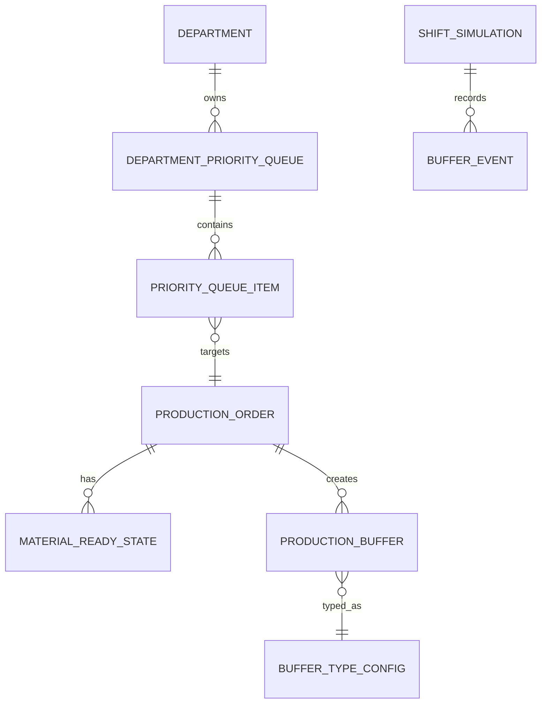

# Depo, Kuyruklar ve Öncelik Planlama

## Amaç

Bu doküman depo girişini, üretim aşamaları arasındaki kuyrukları ve oyuncunun vardiya başlamadan önce drag-drop ile belirleyeceği öncelik sıralamasını tanımlar.

Amaç, oyuncuya karmaşık stok ekranları göstermek değil; kesimden itibaren her departmanın önünde yeterli iş olup olmadığını sade ve karar odaklı şekilde göstermektir.

## Temel Kararlar

- Depo hesabı basit tutulur.
- Kumaş sipariş edilir, depoya girdiği gün kesime hazır sayılır.
- Depo, renk veya tedarikçi bazlı karmaşık takip yapmaz.
- Kesim tamamlandıkça işler bir sonraki aşamanın kuyruğuna girer.
- Oyuncu vardiya başlamadan önce üretim ve kuyruk önceliklerini drag-drop ile sıralayabilir.
- Vardiya başladıktan sonra ana öncelik planı kilitlenir.
- Departman doluluk güvenliği kuyrukta bekleyen ürün miktarına göre değerlendirilir.

## Depo Mantığı

Depo şu sorulara cevap verir:

```text
Kumaş depoda mı?
Kumaş kesime hazır mı?
Kesim hangi siparişten başlamalı?
```

Kural:

```text
Kumaş depoya girdiği gün kesime hazırdır.
Kumaş hazır değilse kesim başlayamaz.
```

Örnek:

```text
Sipariş: Cameo 2000 adet
Kumaş ihtiyacı: 240 metre
Kumaş tedarik süresi: 5 gün
Day 5: Kumaş depoya girer
Day 5: Kesim için hazır olur
```

## Ara Kuyruklar

Tekstil üretiminde ana kuyruklar:

```text
CUT_READY
SEWN_READY
IRON_READY
PACKED_READY / SHIP_READY
```

Kuyruk mantığı:

- Kesim tamamlandıkça `CUT_READY` oluşur.
- Dikim `CUT_READY` kuyruğunu tüketir.
- Dikim tamamlandıkça `SEWN_READY` oluşur.
- Ütü `SEWN_READY` kuyruğunu tüketir.
- Ütü tamamlandıkça `IRON_READY` oluşur.
- Paket `IRON_READY` kuyruğunu tüketir.
- Paket tamamlandıkça `SHIP_READY` oluşur.

Bu yapı oyuncuya darboğazları doğrudan gösterir.

## Öncelik Planlama

Oyuncu vardiya başlamadan önce kuyruk ve üretim önceliklerini değiştirebilmelidir.

UI prensibi:

```text
Drag-drop ile öncelik sıralaması
```

Bu öncelikler planlama ana ekranı ve departman detay ekranında yönetilmelidir. Değişiklik yapıldığında sipariş timeline ve departman yoğunluk tahminleri güncellenmelidir.

Örnek kesim önceliği:

```text
1. MDL-FW-1254
2. Cameo
3. Manama
```

Örnek dikim kuyruğu önceliği:

```text
1. Cameo - CUT_READY: 240 adet
2. Manama - CUT_READY: 120 adet
3. MDL-FW-7512 - CUT_READY: 80 adet
```

Vardiya başladığında sistem bu sıralamaya göre otomatik tüketim yapar. Bir iş bittiğinde aynı ürün bir sonraki aşamanın kuyruğuna girer.

## Departman Güvenlik Bandı

Tekstilde insan faktörü yoğun olduğu için her departmanın önünde belli bir güvenli iş kuyruğu olmalıdır.

Kuyruk güvenliği departmanın günlük tüketim kapasitesine göre değerlendirilir:

```text
Kuyruk Gün Karşılığı = Kuyruktaki Adet / Sonraki Departmanın Günlük Kapasitesi
```

Örnek:

```text
CUT_READY: 300 adet
Dikim günlük kapasite: 100 adet
Kuyruk gün karşılığı: 3 gün
Durum: İdeal
```

Önerilen bantlar:

```text
0 - 1 gün: Kritik düşük
1 - 2 gün: Düşük güvenlik
3 - 5 gün: İdeal kuyruk
6 - 7 gün: Yüksek ama kabul edilebilir
8 - 10 gün: Fazla birikim
10+ gün: Ciddi darboğaz veya kapasite uyumsuzluğu
```

## Kuyruk Yorumları

Kritik düşük:

```text
Dikim yakında kesim kuyruğu bekleyebilir.
Kesim hazırlığını öne alman önerilir.
```

İdeal:

```text
Dikim önünde 3 günlük güvenli iş var.
Line'ların aç kalma riski düşük.
```

Fazla birikim:

```text
Ütü önünde 9 günlük iş birikti.
Ütü kapasitesi yetersiz kalıyor; yeni ütü hattı veya verimlilik yatırımı düşün.
```

## 1-2 Gün Önden Hazırlık Prensibi

Oyuncu kesimden itibaren birer günlük hazırlığı planlayabilmelidir.

Öneri:

- Kesim, dikimin en az 1-2 günlük ihtiyacını önden hazırlamalıdır.
- Dikimden çıkan ürünler, ütünün en az 1-2 günlük ihtiyacını beslemelidir.
- Paketleme ve sevkiyat tarafında da benzer güvenlik takibi yapılmalıdır.

Bu sistem oyuncunun planlama becerisini ödüllendirir:

```text
Dikim kapasiten güçlü.
Kesim kuyruğunu 2 gün önde tutarsan line bekleme riskin azalır.
```

## Darboğaz ve Yatırım Uyarıları

Kuyruklar sadece bekleme listesi değil, yatırım önerisi kaynağıdır.

Uyarı örnekleri:

```text
CUT_READY düşük:
Kesim kapasitesi dikimi besleyemiyor.

SEWN_READY yüksek:
Ütü kapasitesi dikimden gelen işi eritmekte zorlanıyor.

IRON_READY yüksek:
Paketleme yavaş kaldı; sevkiyata hazır ürün oluşumu gecikiyor.

SHIP_READY yüksek:
Sevkiyat kapasitesi veya teslim planı kontrol edilmeli.
```

Kural:

```text
Bir kuyruk 8-10 günlük seviyeye ulaşıyorsa bir sonraki işlem kapasitesi yetersiz olabilir.
```

## UI Sinyalleri

Oyuncuya çok teknik veri gösterilmemelidir.

Gösterilecek sade sinyaller:

- Kuyruk adı.
- Adet.
- Gün karşılığı.
- Durum etiketi.
- Önerilen aksiyon.

Örnek:

```text
CUT_READY
320 adet
3.2 gün
Durum: İdeal

SEWN_READY
920 adet
9.1 gün
Durum: Fazla birikim
Öneri: Ütü kapasitesini artır.
```

## Simülasyon Akışı

Vardiya içinde:

1. Departmanlar kendi öncelik listesine bakar.
2. Gerekli kuyrukta iş varsa üretime başlar.
3. Gerekli kuyruk boşsa bekleme süresi oluşur.
4. Operasyon tamamlandığında ürün bir sonraki kuyruğa girer.
5. Kuyruk gün karşılıkları güncellenir.
6. Anlamlı uyarılar oyuncuya gösterilir.

Örnek:

```text
Kesim 40 adet Cameo tamamladı.
Cameo CUT_READY kuyruğuna eklendi.
Dikim Line 1 öncelik listesine göre Cameo tüketmeye başladı.
```

## MVP Kapsamı

- Depoya giren kumaşın kesime hazır sayılması.
- CUT_READY, SEWN_READY, IRON_READY, SHIP_READY kuyrukları.
- Vardiya öncesi drag-drop öncelik sıralaması.
- Kuyruk adet takibi.
- Kuyruk gün karşılığı hesabı.
- 1-2 gün düşük, 3-5 gün ideal, 8-10 gün fazla birikim uyarıları.
- Kuyruk kaynaklı line bekleme raporu.

## ER Taslağı

Bu taslak kavramsal ilişkiyi gösterir.



## Örnekler

Depo:

```text
Kumaş depoya girdi.
Cameo kesime hazır.
```

Kuyruk uyarısı:

```text
Dikim önünde sadece 0.8 günlük kesilmiş iş var.
Kesim önceliğini dikimi besleyecek şekilde düzenle.
```

Yatırım uyarısı:

```text
Ütü önünde 9 günlük iş birikti.
Yeni ütü hattı açmak veya ütü verimliliğini artırmak üretimi rahatlatır.
```

## İleride Genişletilecek Alanlar

- Otomatik önerilen öncelik sıralaması.
- Planlama ekranında takvim yoğunluk haritası.
- Departman bazlı preset planlar.
- Raporlardan otomatik yatırım tavsiyesi.
- Premium / Luxury ürünlerde kalite kontrol kuyrukları.
- Fason dönüş kuyruğu için ayrı görünüm.
