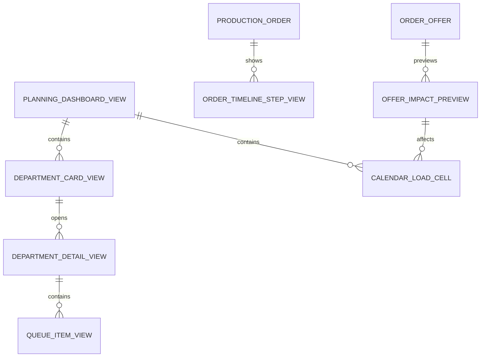

# Planlama UI, Takvim ve Oyuncu Akışı

## Amaç

Bu doküman oyuncunun vardiya başlamadan önce fabrikasını nasıl okuyacağını, departman doluluklarını nasıl yöneteceğini, sipariş ve ürün durumlarını nasıl takip edeceğini ve yeni sipariş kabul ederken üretim bantlarındaki yoğunluğu nasıl göreceğini tanımlar.

Planlama ekranı oyunun ana komuta merkezi olmalıdır. Oyuncu burada sadece line atamaz; fabrikanın birkaç günlük geleceğini, departman kuyruklarını ve kabul edeceği siparişin etkisini görür.

## Temel Kararlar

- Planlama ekranı oyunun ana ekranı gibi çalışmalıdır.
- Ana ekran büyüyen 2.5D fabrika haritası gibi çalışmalıdır.
- Eski departman kartı mantığı harita üzerindeki department zone ve line slot görünümlerine dönüşmelidir.
- Department zone veya line slot tıklanınca ilgili detay ekranı açılmalıdır.
- Takvim ve yoğunluk haritası güçlü kullanılmalıdır.
- Oyuncu ürün / sipariş bazlı olarak işin hangi aşamada olduğunu görebilmelidir.
- Yeni sipariş kabul ekranında mevcut üretim bantlarına etkisi gösterilmelidir.
- UI sade olmalı; oyuncuya tüm hesaplar değil, karar sinyalleri gösterilmelidir.

Fabrika haritası, drag/zoom, minimap ve line slot görsel sistemi için:

```text
20-factory-layout-system.md
```

## Ana Planlama Ekranı

Ana ekran oyuncuya günün durumunu tek bakışta vermelidir.

Üst bölüm:

```text
Day 7
Vardiya: 08:00 - 17:00
Factory Cash
Aktif Sipariş Sayısı
Teslim Riski
Vardiyayı Başlat
```

Orta bölüm:

```text
Fabrika Haritası
Department Zone'lar: Depo | Kesim | Dikim | Ütü/Paket | Sevkiyat | Baskı/Nakış varsa
Line Slot'lar: Boş | Aktif | Yoğun | Riskli | Bakımda | Kilitli
```

Alt veya yan bölüm:

```text
Yaklaşan teslimler
Kritik uyarılar
Ara fırsat önerileri
Bugün yapılacak ana karar
```

## Department Zone ve Line Slot Özetleri

Harita üzerindeki her department zone sade ama karar verdirici bilgiler taşımalıdır. Line slotları ise oyuncunun gerçek atama ve yatırım kararını verdiği birimlerdir.

Zone üzerinde gösterilecek bilgiler:

- Departman adı.
- Bugünkü kapasite kullanımı.
- Önündeki kuyruk adedi.
- Kuyruk gün karşılığı.
- Durum etiketi.
- Kritik uyarı.
- Tıklayınca detay ekranı.

Line slot üzerinde gösterilecek bilgiler:

- Hat adı veya slot numarası.
- Durum: boş, aktif, yoğun, riskli, bakımda, kilitli.
- Atanan sipariş kısa kodu.
- Kapasite kullanımı.
- Kısa progress / glow sinyali.

Örnek:

```text
Dikim
Kapasite: %86
CUT_READY: 320 adet
Kuyruk: 3.2 gün
Durum: İdeal
```

Renk anlamları:

```text
Yeşil: İdeal
Sarı: Dikkat
Kırmızı: Darboğaz / risk
Mavi: Boş kapasite / ara fırsat uygun
Gri: Beklemede / malzeme yok
```

## Takvim ve Yoğunluk Haritası

Takvim, planlama ekranının en önemli parçalarından biridir.

Önerilen görünüm:

```text
Satırlar: Departmanlar
Sütunlar: Günler
Hücreler: Yoğunluk / risk rengi
```

Örnek:

```text
          Day 7  Day 8  Day 9  Day 10  Day 11
Kesim     %90    %70    %40     %30     %25
Dikim     %95    %98    %88     %60     %45
Ütü       %40    %120   %135    %110    %70
Paket     %30    %60    %90     %80     %55
Sevkiyat  %20    %40    %70     %90     %80
```

Hücre renkleri:

- Yeşil: Kapasite sağlıklı.
- Sarı: Yaklaşıyor.
- Kırmızı: Kapasite aşımı / darboğaz.
- Mavi: Boş kapasite.
- Gri: Malzeme veya ön koşul bekliyor.

Takvim aralığı:

```text
MVP: 7 gün
İleride: 14-30 gün
```

## Departman Detay Ekranı

Department zone veya line slot tıklanınca detay ekranı açılır.

Örnek Dikim detayı:

```text
Bugünkü Line'lar
Line 1 -> Cameo
Line 2 -> Manama
Line 3 -> Boşta

CUT_READY Kuyruğu
1. Cameo - 240 adet
2. Manama - 120 adet
3. MDL-FW-7512 - 80 adet
```

Departman detayında bulunacak alanlar:

- Aktif line'lar.
- Line atamaları.
- Kuyruk listesi.
- Drag-drop öncelik sıralaması.
- Günlük kapasite.
- Beklenen bekleme süresi.
- Önerilen aksiyon.

Vardiya başlamadan önce:

```text
Öncelik değiştirilebilir.
Line ataması değiştirilebilir.
```

Vardiya başladıktan sonra:

```text
Ana plan kilitlenir.
Oyuncu sadece izler ve anlamlı olaylara tepki verir.
```

## Kuyruk Drag-Drop Öncelik

Oyuncu kuyruk önceliklerini basit şekilde değiştirebilmelidir.

Örnek:

```text
CUT_READY Kuyruğu
1. Cameo
2. Manama
3. MDL-FW-7512
```

Oyuncu `MDL-FW-7512` siparişini yukarı sürüklerse sistem yeni tahminleri günceller:

```text
MDL-FW-7512 dikime daha erken girer.
Cameo teslim riski biraz artabilir.
```

UI mesajı:

```text
Bu değişiklik MDL-FW-7512 riskini azaltır, Cameo riskini orta seviyeye çıkarır.
```

## Ürün / Sipariş Timeline

Oyuncu ürün veya sipariş bazlı ilerleme görmek isteyecektir.

Sipariş detayında gösterilecek timeline:

```text
Depo: Kumaş hazır
Kesim: Bugün başlayacak
Dikim: Tahmini Day 8
Ütü: Tahmini Day 9
Paket: Tahmini Day 10
Sevkiyat: Tahmini Day 11
Teslim: Day 12
Risk: Güvenli
```

Her aşamada gösterilecek bilgiler:

- Aşama adı.
- Durum: bekliyor, hazır, üretimde, tamamlandı.
- Tahmini başlangıç.
- Tahmini bitiş.
- Bekleyen adet.
- Risk etiketi.

Oyuncu sorularına cevap:

```text
Bu ürün ne zaman dikime girer?
Bu sipariş ne zaman ütüye geçer?
Teslim tarihi güvenli mi?
Hangi aşama bekletiyor?
```

## Yeni Sipariş Etki Önizlemesi

Yeni sipariş kabul ekranında sadece fiyat ve teslim tarihi yeterli değildir. Oyuncu siparişi kabul ederse fabrikanın hangi günlerinde sıkışma oluşacağını görmelidir.

Gösterilecek bilgiler:

- Sipariş özeti.
- Kar potansiyeli.
- Teslim riski.
- Gerekli operasyonlar.
- Eksik kabiliyet.
- Fason ihtiyacı.
- Kumaş / aksesuar hazır olma günü.
- Departman yoğunluk etkisi.
- Takvim yoğunluk haritası.

Örnek:

```text
Cameo - 2000 adet
Teslim: Day 12
Kar: İyi
Risk: Orta

Plan Etkisi:
Kesim: Uygun
Dikim: Day 8-10 yoğun
Ütü: Day 10 kırmızı
Paket: Güvenli
Fason: Baskı 4 gün
```

Oyuncu mesajı:

```text
Bu sipariş karlı, fakat ütü kapasiten Day 10'da sıkışacak.
Ütü hattı açmadan kabul edersen teslim riski artabilir.
```

## Yoğunluk Haritası Hesabı

Yoğunluk haritası mevcut siparişler, kuyruklar, kapasite ve yeni teklifin reçetesi üzerinden hesaplanmalıdır.

Basit hesap:

```text
Günlük Departman Yükü = O gün işlenecek operasyon süresi / Departman günlük kapasitesi
```

Yorum:

```text
0-70%: Rahat
70-95%: Sağlıklı yoğun
95-110%: Dikkat
110%+: Kapasite aşımı
```

Kuyruklarla bağlantı:

```text
Kuyruk düşükse departman aç kalabilir.
Kuyruk çok yüksekse sonraki departman kapasitesi yetersizdir.
```

## Vardiyayı Başlat Akışı

Oyuncu vardiyayı başlatmadan önce sistem son kontrol yapmalıdır.

Kontrol listesi:

- Aktif line'lar atanmış mı?
- Kritik siparişler planlanmış mı?
- Kumaşı hazır olmayan sipariş kesime alınmış mı?
- Aksesuar eksikliği operasyonu blokluyor mu?
- Kuyruk öncelikleri belirlenmiş mi?
- Kritik darboğaz uyarısı var mı?

Başlatma öncesi mesaj örneği:

```text
Vardiya hazır.
1 kritik uyarı var: Dikim yarın CUT_READY kuyruğu bekleyebilir.
Kesim önceliğini değiştirmeden başlatmak istiyor musun?
```

## Oyuncuya Gösterilecek Basit Sinyaller

Oyuncuya ERP benzeri ağır metrikler verilmemelidir.

Kullanılacak sinyaller:

- Güvenli.
- Dikkat.
- Riskli.
- Darboğaz.
- Boş kapasite.
- İdeal kuyruk.
- Fazla birikim.
- Malzeme bekliyor.
- Fason bekliyor.

Örnekler:

```text
Dikim güvenli.
Ütü riskli.
Paketleme boş kapasiteye sahip.
Cameo Day 8'de dikime girecek.
Bu sipariş ütü tarafını kırmızıya çevirecek.
```

## MVP Kapsamı

- Ana planlama ekranı.
- Department zone ve line slot özetleri.
- 7 günlük takvim / yoğunluk haritası.
- Departman detay ekranı.
- Kuyruk drag-drop öncelik.
- Ürün / sipariş timeline.
- Yeni sipariş etki önizlemesi.
- Vardiyayı başlat ön kontrolü.

## ER / View Model Taslağı

Bu taslak UI ve backend arasında ihtiyaç duyulacak görünüm modellerini gösterir.



## Örnekler

Department zone özeti:

```text
Ütü
Kapasite: %132
SEWN_READY: 920 adet
Kuyruk: 9.1 gün
Durum: Darboğaz
Öneri: Ütü kapasitesini artır.
```

Sipariş timeline:

```text
Cameo
Depo: Hazır
Kesim: Day 7
Dikim: Day 8
Ütü: Day 10
Paket: Day 11
Sevkiyat: Day 12
Risk: Orta
```

Sipariş kabul önizlemesi:

```text
Bu sipariş kabul edilirse:
Day 9 Dikim %98
Day 10 Ütü %135
Day 11 Paket %80

Ana risk: Ütü kapasitesi.
```

## İleride Genişletilecek Alanlar

- 14-30 günlük gelişmiş takvim.
- Otomatik plan önerisi.
- Plan karşılaştırma.
- Drag-drop sonrası anlık simülasyon önizlemesi.
- Departman bazlı preset planlar.
- Mobil için sade kart görünümü.
- Premium / Luxury kalite kontrol timeline'ları.
- Fason dönüş tarihlerini takvimde gösterme.
