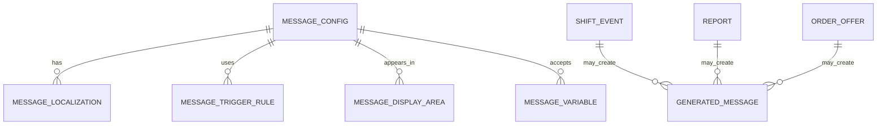

# Mesaj Config, Uyarı Grupları ve Çoklu Dil Sistemi

## Amaç

Bu doküman Factory Runway'de oyuncuya gösterilecek mesajların nasıl gruplandırılacağını, config yapısıyla nasıl yönetileceğini, çoklu dil desteğinin nasıl planlanacağını ve uyarı mesajlarının ilk ana hatlarını tanımlar.

Factory Runway üretim, planlama, risk, rapor ve yatırım kararları üzerinden çok mesaj kullanacaktır. Bu yüzden mesajlar kod içine dağılmamalı; mesaj anahtarları, tetik koşulları, öncelik seviyesi ve dil metinleri config / localization yapısıyla yönetilmelidir.

## Temel Kararlar

- Mesajlar config üzerinden yönetilmelidir.
- Çoklu dil desteği baştan düşünülmelidir.
- Kod tarafı mesaj metni değil, mesaj anahtarı üretmelidir.
- Mesaj metinleri test sürecinde genişletilebilir ve değiştirilebilir olmalıdır.
- Başlangıçta tüm mesajları yazmak hedeflenmez; ana mesaj grupları ve tetik mantıkları belirlenir.
- Oyuncu dili sade, oyun hissi veren ve karar odaklı olmalıdır.
- Ağır ERP dili kullanılmamalıdır.

## Mesajın Amacı

Her mesaj şu sorulardan en az birine cevap vermelidir:

- Ne oldu?
- Neden oldu?
- Oyuncu ne yapabilir?
- Bu durum teslim riskini nasıl etkiler?
- Bu durum yatırım kararını nasıl etkiler?
- Bu durum güvenilirlik / bilinirlik puanını nasıl etkiler?

Kötü mesaj:

```text
Buffer starvation detected.
```

İyi mesaj:

```text
Dikim line'ı kesim kuyruğu bekliyor.
Kesim önceliğini değiştirirsen line boş kalma süresi azalabilir.
```

## Mesaj Grupları

Başlangıç mesaj grupları:

- `planning`: Vardiya öncesi planlama uyarıları.
- `queue`: Kuyruk doluluk ve darboğaz mesajları.
- `order_risk`: Teslim tarihi ve sipariş riski mesajları.
- `shift_event`: Vardiya içi olay mesajları.
- `machine`: Makine arızası ve bakım mesajları.
- `staff`: Personel eksikliği ve verimlilik mesajları.
- `material`: Kumaş ve malzeme hazır olma mesajları.
- `accessory`: Aksesuar eksikliği mesajları.
- `subcontract`: Fason iş ve gecikme mesajları.
- `investment`: Yatırım / upgrade tavsiyeleri.
- `reputation`: Güvenilirlik ve bilinirlik mesajları.
- `opportunity`: Ara fırsat siparişi mesajları.
- `report`: Gün sonu raporu mesajları.
- `tutorial`: Wizard ve başlangıç yönlendirmeleri.
- `system`: Genel sistem, kayıt ve hata dışı durum mesajları.

## Mesaj Önem Seviyeleri

Mesajlar önem seviyesine sahip olmalıdır.

```text
info
success
warning
critical
recommendation
```

Kullanım:

- `info`: Bilgilendirme.
- `success`: Başarılı teslim, ödeme, unlock.
- `warning`: Dikkat gerektiren durum.
- `critical`: Teslim riski, üretim blokajı, ciddi darboğaz.
- `recommendation`: Yatırım veya plan değişikliği önerisi.

## Mesaj Gösterim Alanları

Mesajın nerede görüneceği ayrıca tanımlanmalıdır.

```text
planning_dashboard
department_card
department_detail
offer_acceptance
shift_live_feed
end_of_day_report
order_detail
investment_screen
tutorial_wizard
```

## Message Config Alanları

Bir mesaj config kaydı en az şu alanları taşımalıdır:

- `messageKey`
- `group`
- `severity`
- `displayAreas`
- `trigger`
- `cooldown`
- `priority`
- `variables`
- `defaultLocale`
- `localizationKey`
- `actionHint`
- `relatedSystem`

Örnek:

```text
messageKey: queue.cutting.low_for_sewing
group: queue
severity: warning
displayAreas:
  - planning_dashboard
  - department_card
trigger: CUT_READY queue days < 1
cooldown: once_per_shift
priority: 70
variables:
  - queueDays
  - departmentName
  - lineName
localizationKey: messages.queue.cutting.low_for_sewing
actionHint: cutting_priority
relatedSystem: warehouse_queues
```

## Localization Yapısı

Mesajlar dil dosyalarında tutulmalıdır.

Önerilen yapı:

```text
locales/
  tr/
    messages.json
  en/
    messages.json
```

Örnek Türkçe:

```json
{
  "messages": {
    "queue": {
      "cutting": {
        "low_for_sewing": "Dikim yakında kesim kuyruğu bekleyebilir. Kesim önceliğini değiştirmen önerilir."
      }
    }
  }
}
```

Örnek İngilizce:

```json
{
  "messages": {
    "queue": {
      "cutting": {
        "low_for_sewing": "Sewing may soon run out of cut pieces. Consider moving cutting priority up."
      }
    }
  }
}
```

## Değişkenli Mesajlar

Mesajlar değişken kullanabilmelidir.

Örnek:

```text
{{departmentName}} önünde {{queueDays}} günlük iş birikti.
{{suggestedAction}} önerilir.
```

Değişkenler sade tutulmalıdır:

- `departmentName`
- `orderCode`
- `productName`
- `queueDays`
- `quantity`
- `dueDay`
- `riskLevel`
- `factoryCash`
- `capacityPercent`
- `suggestedAction`

## Uyarı Mesajı Ana Hatları

Başlangıçta tüm mesaj metinleri tamamlanmayacaktır. İlk aşamada aşağıdaki uyarı aileleri yeterlidir.

### Queue Uyarıları

```text
queue.low
queue.ideal
queue.high
queue.bottleneck
```

Örnekler:

```text
Dikim önünde sadece {{queueDays}} günlük kesilmiş iş var.
Kesim önceliğini yükseltmen önerilir.
```

```text
Ütü önünde {{queueDays}} günlük iş birikti.
Ütü kapasitesi yetersiz kalıyor olabilir.
```

### Order Risk Uyarıları

```text
order.due_date_at_risk
order.needs_more_line
order.material_not_ready
order.accessory_blocked
```

Örnekler:

```text
{{orderCode}} teslim tarihine yetişmeyebilir.
Bu siparişe 1 line daha ayırman riski azaltabilir.
```

```text
{{productName}} için kumaş henüz hazır değil.
Kesim kumaş depoya girene kadar başlayamaz.
```

### Shift Event Uyarıları

```text
shift.machine_breakdown
shift.staff_missing
shift.queue_wait
shift.subcontract_delay
```

Örnekler:

```text
{{lineName}} makine arızası nedeniyle {{minutes}} dakika düşük kapasite çalışacak.
```

```text
Bugün {{departmentName}} ekibinde eksik personel var.
Verimlilik düşebilir.
```

### Investment Uyarıları

```text
investment.add_line
investment.add_machine
investment.unlock_capability
investment.spare_machine
```

Örnekler:

```text
Son günlerde ütü önünde sık sık birikim oluşuyor.
Yeni ütü hattı açmak üretimi rahatlatabilir.
```

```text
Baskı işlerini sık sık fasona gönderiyorsun.
Baskı makinesi yatırımı uzun vadede karlılığı artırabilir.
```

### Opportunity Uyarıları

```text
opportunity.available
opportunity.good_fit
opportunity.risky_fit
```

Örnekler:

```text
Ara fırsat: Yarın dikim hattında boş kapasite görünüyor.
Küçük ve karlı bir siparişi araya alabilirsin.
```

```text
Bu ara fırsat karlı, fakat mevcut riskli siparişlerin teslim baskısını artırabilir.
```

### Reputation Mesajları

```text
reputation.increased
reputation.decreased
reputation.large_orders_unlocked
```

Örnekler:

```text
Siparişi zamanında sevk ettin.
Güvenilirliğin arttı.
```

```text
Güvenilirliğin arttığı için daha büyük adetli siparişler görünmeye başladı.
```

## Mesaj Öncelik ve Filtreleme

Oyuncuya aynı anda çok fazla mesaj gösterilmemelidir.

Kurallar:

- Aynı mesaj aynı vardiyada tekrar tekrar gösterilmemeli.
- Critical mesajlar warning mesajlardan önce gelmeli.
- Aynı sistemden gelen çok sayıda küçük uyarı özetlenmeli.
- Vardiya içinde sadece anlamlı olaylar gösterilmeli.
- Gün sonu raporunda detaylı özet verilebilir.

Örnek özet:

```text
Bugün 4 küçük kuyruk bekleme olayı yaşandı.
Toplam line bekleme süresi: 74 dakika.
```

## Wizard ve Learning Loop

Başlangıçta oyuncuya wizard ile temel sistemler anlatılacaktır:

- İlk siparişi kabul et.
- Line ata.
- Kuyrukları oku.
- Vardiyayı başlat.
- Gün sonu raporunu yorumla.
- İlk yatırım kararını ver.

Learning loop ilk aşamada basit tutulmalıdır. Oyuncunun verimsiz geçen günleri zaten başarısızlığa veya doğru karar ihtiyacına götürür.

Önemli karar:

```text
Mesaj metinleri test sırasında gerçek simülasyon sonuçlarına göre genişletilecek.
```

Yani ilk aşamada amaç tüm nihai metinleri yazmak değil, mesaj config altyapısını doğru kurmaktır.

## Test Sürecinde Mesaj Geliştirme

Kodlama ve deneme sırasında günler ilerletildikçe sistemin eksik mesajları yakalanmalıdır.

Test notu örneği:

```text
Day 12 testinde ütü 3 gün üst üste darboğaz oldu.
Oyuncuya yatırım önerisi yeterince açık değildi.
Yeni mesaj gerekiyor: investment.ironing.repeated_bottleneck
```

Bu yaklaşım mesaj kütüphanesini gerçek oynanıştan besler.

## MVP Kapsamı

MVP için mesaj sistemi şunları kapsamalıdır:

- Message key yapısı.
- Türkçe varsayılan mesajlar.
- İngilizce için hazır localization alanı.
- Queue uyarıları.
- Order risk uyarıları.
- Shift event uyarıları.
- Investment önerileri.
- Opportunity mesajları.
- Reputation mesajları.
- Gün sonu rapor özet mesajları.

## ER / Config Taslağı

Bu taslak kavramsal ilişkiyi gösterir.



## Örnek Config Taslağı

```text
messageKey: investment.ironing.repeated_bottleneck
group: investment
severity: recommendation
displayAreas:
  - end_of_day_report
  - planning_dashboard
trigger: ironing bottleneck count >= 3 days
cooldown: once_per_day
priority: 80
variables:
  - bottleneckDays
  - departmentName
localizationKey: messages.investment.ironing.repeated_bottleneck
```

Türkçe metin:

```text
Ütü tarafında {{bottleneckDays}} gündür birikim oluşuyor.
Yeni ütü hattı veya verimlilik yatırımı üretimi rahatlatabilir.
```

İngilizce metin:

```text
Ironing has been backed up for {{bottleneckDays}} days.
Adding an ironing line or improving efficiency may ease production.
```

## İleride Genişletilecek Alanlar

- Sektöre özel mesaj tonları.
- Oyuncu seviyesine göre mesaj detay seviyesi.
- Aynı mesajın kısa / uzun varyasyonları.
- A/B test mesajları.
- Admin mesaj editörü.
- Sesli veya görsel uyarı tipleri.
- Bildirim geçmişi.
- Oyuncu tercihine göre mesaj yoğunluğu.
