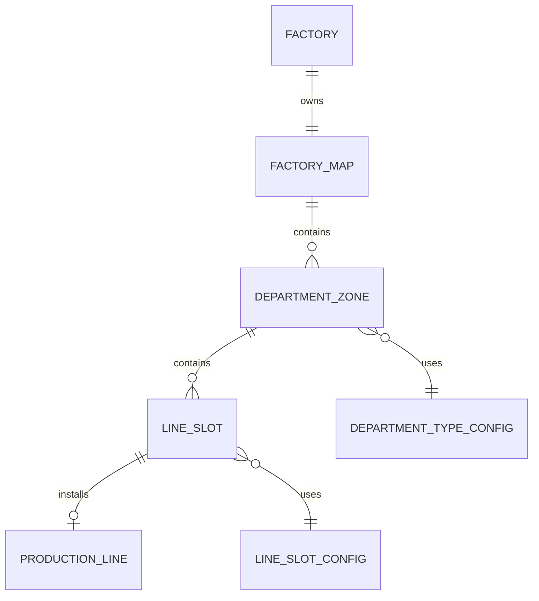

# Factory Layout System

## Amaç

Bu doküman Factory Runway'de ana fabrika ekranının nasıl çalışacağını tanımlar.

Hedef, oyuncuya sadece departman kartları göstermek değil; büyüyen, genişleyen, yatırımların görsel olarak hissedildiği bir fabrika zemini sunmaktır. Oyuncu yeni hat açtığında, yeni departman kilidi kaldırdığında veya bakım riski oluştuğunda bunu doğrudan harita üzerinde görmelidir.

Bu sistem planlama, vardiya izleme, yatırım ve hat atama ekranlarının ortak görsel temelidir.

## Görselden Çıkan Ana Karar

Ana ekran kart tabanlı bir dashboard gibi değil, 2.5D fabrika haritası gibi düşünülmelidir.

Harita üzerinde:

- Departman bölgeleri sabit üretim sırasına göre dizilir.
- Her departman içinde line slotları bulunur.
- Oyuncu boş, kilitli, aktif, dolu, riskli ve bakımda olan hatları tek bakışta görür.
- Sağ panel seçilen hattın detayını gösterir.
- Sol menü ana oyun bölümlerine geçiş sağlar.
- Üst HUD nakit, gün/saat, aktif sipariş, üretim ve verimlilik gibi global bilgileri taşır.
- Minimap ve zoom kontrolleri büyük fabrikanın okunmasını kolaylaştırır.

## Factory Map Mantığı

Factory Map, fabrikanın fiziksel oyun alanıdır.

Temel kararlar:

- Harita viewport'tan büyük olabilir.
- Oyuncu haritayı sürükleyerek gezebilir.
- Zoom yapılabilir.
- Departmanlar mutlak koordinatlarla yerleşir.
- UI panelleri harita katmanından ayrı overlay olarak çalışır.
- Fabrika büyüdükçe haritanın yeni bölgeleri açılır.

Önerilen veri alanları:

```text
FactoryMap
- id
- factoryId
- mapWidth
- mapHeight
- currentZoom
- minZoom
- maxZoom
- defaultCenterX
- defaultCenterY
- unlockedAreaLevel
- visualTheme
```

Başlangıç haritası küçük bir atölye hissi vermelidir. Oyuncu büyüdükçe aynı zeminde yeni alanlar, departman genişlemeleri ve yeni line slotları görünmelidir.

## Department Zone Yapısı

Department Zone, harita üzerindeki üretim bölgesidir.

Tekstil için önerilen ana sıra:

```text
Kumaş Üretim -> Kumaş Depo -> Kesim -> Ara İşlemler -> Dikim -> Ütü/Paket -> Sevkiyat
```

Başlangıçta bazı zone'lar kilitli olabilir:

- Kumaş Üretim: Entegre tesis seviyesinde açılır.
- Ara İşlemler: Baskı / nakış gibi capability yatırımlarıyla açılır.
- Kalite Kontrol: Premium ve Luxury üretim için açılır.
- Boya / Yıkama: Daha ileri katma değerli ürünlerde açılır.

Önerilen veri alanları:

```text
DepartmentZone
- id
- factoryId
- departmentType
- title
- x
- y
- width
- height
- unlockState
- unlockRequirement
- maxSlots
- visibleSlotCount
- departmentLevel
- zoneStatus
```

Zone durumu:

```text
Locked
Empty
Healthy
Busy
Risk
Bottleneck
Maintenance
```

Zone oyuncuya departmanın genel sağlığını söyler; line slotları ise karar verilecek gerçek birimleri gösterir.

## Production Line Slot Sistemi

Line Slot, departman içinde yeni bir hat kurulabilecek fiziksel alandır.

Slot durumları:

```text
Locked      -> Bu alan henüz açılmadı.
Empty       -> Alan açık, yeni hat kurulabilir.
Active      -> Hat kurulu, atanabilir.
Busy        -> Hat şu anda üretimde.
Risk        -> Hat gecikme, kalite veya kuyruk riski taşıyor.
Maintenance -> Hat bakımda veya arıza etkisinde.
```

Önerilen veri alanları:

```text
LineSlot
- id
- departmentZoneId
- slotIndex
- x
- y
- width
- height
- state
- installedLineId
- unlockCost
- requiredFactoryLevel
- requiredDepartmentLevel
```

Oyuncu yeni hat eklediğinde:

1. İlgili departmanda `Empty` slot aranır.
2. Uygun slot varsa yeni hat bu slota kurulur.
3. Slot `Active` olur.
4. Hat üretime atanırsa `Busy` olur.
5. Boş slot yoksa sistem departman genişletme veya factory level ihtiyacını gösterir.

Oyuncu mesajı:

```text
Dikim bölgesinde boş slot kalmadı.
Yeni dikim hattı açmak için Dikim Alanı Genişletme yatırımı gerekir.
```

## Fabrika Ekranı Nasıl Büyür?

Fabrika büyümesi üç seviyede görünür olmalıdır:

```text
1. Slot açılır
2. Zone genişler
3. Yeni zone açılır
```

Örnek büyüme:

```text
Atölye
- Dikim 2 slot
- Kesim 1 slot
- Ütü/Paket 1 slot

Gelişen Atölye
- Dikim 4 slot
- Kesim 2 slot
- Ara İşlemler için ilk alan

Küçük Fabrika
- Dikim 8 slot
- Baskı ve Nakış aktif
- Ütü/Paket 3 slot

Entegre Tesis
- Kumaş Üretim açılır
- Kalite Güvence zone'u açılır
- Büyük sevkiyat alanı açılır
```

Yeni hat eklendiğinde görsel alan doğrudan değişmelidir:

- Boş slotta yeni prefab görünür.
- Zone içindeki doluluk sayacı artar.
- Minimap üzerinde yeni aktif nokta görünür.
- Üstteki hat durum sayaçları güncellenir.
- Sipariş atama ekranında yeni kapasite hesaplamaya dahil edilir.

## Locked / Empty / Active / Busy / Risk / Maintenance Durumları

Durumlar yalnızca renk değil, oyuncu karar sinyali üretmelidir.

```text
Locked:
Henüz açılmamış yatırım alanı.

Empty:
Oyuncunun yatırım yapabileceği boş slot.

Active:
Hat kurulu ve kullanılabilir.

Busy:
Hat üretim yapıyor veya vardiya için atanmış durumda.

Risk:
Hat atandığı siparişi yetiştirmekte zorlanıyor, kuyruk bekliyor veya kalite riski var.

Maintenance:
Hat arıza, bakım veya geçici verim düşüşü altında.
```

Renk önerisi:

```text
Active: Yeşil glow
Busy: Sarı / amber glow
Risk: Kırmızı glow
Maintenance: Turuncu / gri uyarı
Empty: Mavi kesikli sınır
Locked: Gri kesikli sınır + kilit ikonu
```

## Drag + Zoom Davranışı

Oyuncu fabrika haritasını oyun alanı gibi gezmelidir.

Davranış kararları:

- Mouse drag / touch drag ile harita hareket eder.
- Mouse wheel veya pinch ile zoom yapılır.
- Zoom sınırları vardır.
- UI overlay panelleri zoomdan etkilenmez.
- Line ve zone seçimleri zoom seviyesinden bağımsız çalışır.
- Seçilen line görünür alana yakınsa sağ detay paneli açılır.
- Boş zemine tıklayınca seçim temizlenir.

Önerilen değerler:

```text
minZoom: 0.6
defaultZoom: 0.85
maxZoom: 1.3
```

Mobilde:

- Varsayılan zoom daha düşük olabilir.
- Sağ panel tam ekran alt drawer'a dönüşebilir.
- Alt menü daha kısa tutulabilir.

## Minimap / Center View / Fit View Mantığı

Büyük fabrika haritası için minimap şarttır.

Minimap göstermeli:

- Haritanın tamamı.
- Görünen viewport alanı.
- Aktif hat noktaları.
- Riskli hat noktaları.
- Seçili departman veya line.

Kontroller:

```text
Center View:
Seçili line veya departmanı ortalar.

Fit View:
Tüm açık fabrika alanını ekrana sığdırır.

Default View:
Oyuncunun son bıraktığı kamera konumuna veya ana üretim bölgesine döner.
```

## MVP Kapsamı

İlk uygulanabilir kapsam:

- Büyük 2.5D fabrika zemini.
- Drag ile harita hareketi.
- Temel zoom.
- Textile Pack ana departman zone'ları.
- Line slot durumları.
- Empty / Locked / Active / Busy / Risk / Maintenance görsel durumları.
- Seçili line için sağ detay paneli.
- Basit minimap.
- Yeni hat açıldığında slotun görsel olarak aktif hale gelmesi.

MVP'de şimdilik derinleştirilmeyecekler:

- Serbest bina yerleştirme.
- Oyuncunun departmanları istediği yere taşıması.
- Çok detaylı yol / forklift / lojistik animasyonları.
- Tam ölçekli dekorasyon sistemi.

## İleride Genişletilecek Alanlar

- Serbest veya yarı serbest fabrika yerleşimi.
- Departman taşıma / yeniden düzenleme.
- Dekoratif tema ve kozmetik fabrika skinleri.
- Üretim akışını gösteren animasyonlu parçalar.
- Bakım ekiplerinin haritada hareket etmesi.
- Gelişmiş minimap filtreleri.
- Sektör paketlerine özel prefab ve zone yerleşimleri.

## ER Taslağı



## Örnek

```text
Dikim Zone
- Toplam slot: 6
- Aktif hat: 4
- Boş slot: 1
- Kilitli slot: 1
- Riskli hat: Hat 03

Oyuncu Hat 03'e tıklar.
Sağ panel açılır:
- Atanan sipariş
- Kapasite kullanımı
- Çalışan sayısı
- Günlük çıktı
- Kuyruk günü
- Kalite puanı
- Bakım / upgrade aksiyonları
```
