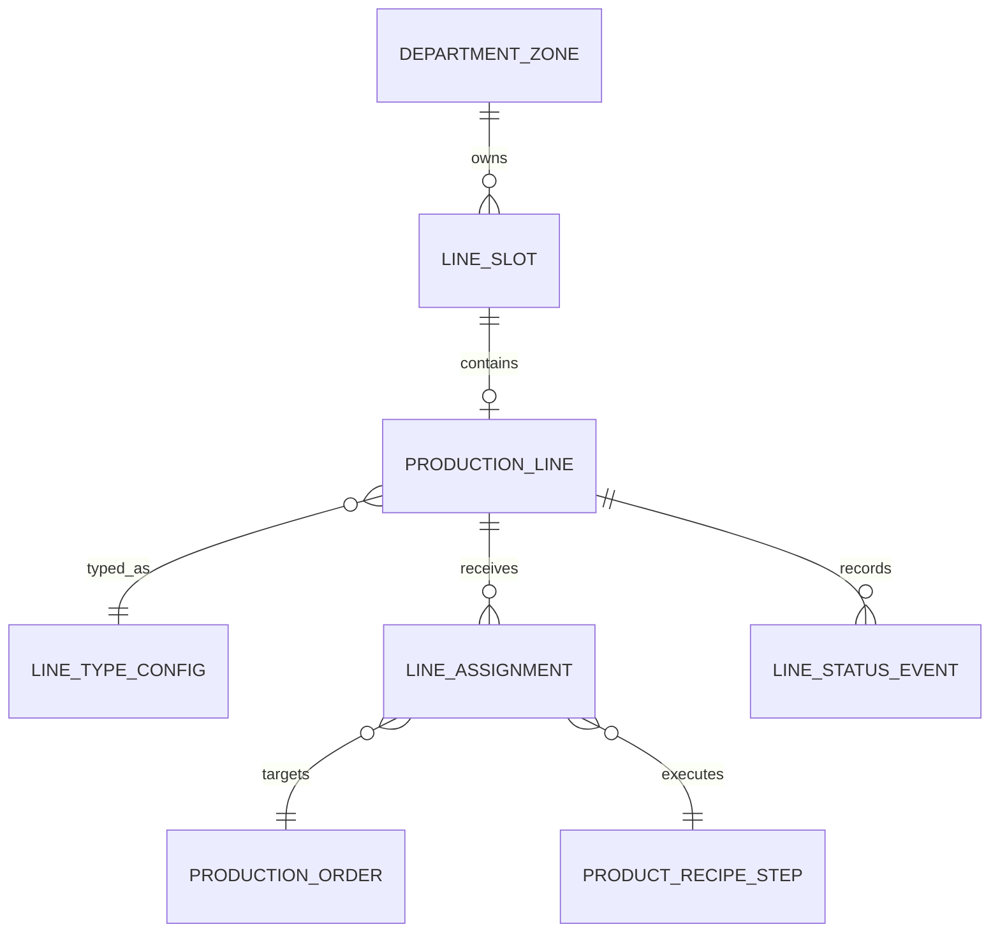

# Production Line System

## Amaç

Bu doküman Factory Runway'de üretim hatlarının nasıl çalışacağını tanımlar.

Oyunun gerçek karar alanı line seviyesindedir. Oyuncu sadece "dikim kapasitem var" dememeli; hangi siparişi hangi hatta vereceğini, hangi hattın daha verimli olduğunu, hangi hattın bakım riski taşıdığını ve hangi departmanın darboğaz oluşturduğunu görebilmelidir.

## Temel Kararlar

- Line, üretim kararının ana birimidir.
- Her line bir departman içindeki bir slotta bulunur.
- Her line belirli operasyonları destekler.
- Bir line aynı anda tek ana işi çalışır.
- Aynı sipariş birden fazla line'a bölünebilir.
- Line verimliliği, personel, makine durumu, ürün zorluğu, kuyruk durumu ve bakım riskinden etkilenir.
- Line'ın görsel durumu fabrika haritasında anlık okunmalıdır.

## Line Türleri

Textile Pack için ilk line türleri:

```text
Fabric Production Line
Fabric Warehouse Slot
Cutting Line
Printing Line
Embroidery Line
Special Process Line
Sewing Line
Ironing / Packing Line
Shipping Line
Quality Control Line
```

Her sektör kendi line türlerini ekleyebilir, fakat core line modeli aynı kalmalıdır.

## Line Verisi

Önerilen ana alanlar:

```text
ProductionLine
- id
- factoryId
- departmentZoneId
- lineSlotId
- lineCode
- lineName
- lineType
- supportedOperations
- status
- assignedOrderId
- assignedRecipeStepId
- activeRunId
- staffRequired
- staffAssigned
- baseEfficiency
- currentEfficiency
- conditionScore
- qualityScore
- maintenanceRisk
- dailyCapacityEstimate
- currentQueueDays
- installedAtDay
- technologyLevel
- technologyConfigId
- speedModifier
- wasteRateModifier
- qualityModifier
- maxProductTier
```

Line tipi config ile yönetilmelidir:

```text
LineTypeConfig
- lineType
- departmentType
- supportedOperations
- requiredStaff
- requiredMachines
- baseOutputFormula
- baseInstallCost
- baseMaintenanceCost
- requiredFactoryLevel
- requiredDepartmentLevel
- visualPrefabKey
```

## Line Durumları

```text
Locked:
Slot veya line henüz açılmadı.

Empty:
Slot açık ama line kurulmadı.

Active:
Line kurulu ve atama alabilir.

Busy:
Line vardiyada üretim yapıyor.

Idle:
Line kurulu ama iş bekliyor.

WaitingInput:
Line çalışmak istiyor ama gerekli kuyruk veya malzeme yok.

Risk:
Teslim, kalite, bakım veya kuyruk nedeniyle uyarı veriyor.

Maintenance:
Bakımda veya arıza etkisinde.
```

Harita üzerinde oyuncuya gösterilecek ana durumlar sade tutulabilir:

```text
Boş Hat
Aktif Hat
Dolu Hat
Riskli Hat
Bakımda
Kilitli Slot
```

## Kapasite Hesabı

Tek vardiya `540 dakika` GameTime üzerinden hesaplanır.

Basit formül:

```text
dailyLineCapacity =
floor(
  shiftMinutes
  * currentEfficiency
  * staffModifier
  * machineModifier
  / effectiveOperationMinutesPerUnit
)
```

Ürün reçetesindeki süre admin tarafından tanımlanan standart süredir. Oyuncunun line teknolojisi bu süreyi değiştirir:

```text
effectiveOperationMinutesPerUnit =
productOperationMinutesPerUnit
* technologySpeedModifier
* productDifficultyModifier
* conditionModifier
```

Örnek:

```text
Admin standart kesim süresi: 0.8 dk / adet
Kesim Level 1 teknoloji çarpanı: 1.00
Gerçek süre: 0.8 dk / adet

Kesim Level 3 teknoloji çarpanı: 0.62
Gerçek süre: 0.496 dk / adet
```

Örnek:

```text
Vardiya: 540 dk
Dikim süresi: 8 dk / adet
Line verimliliği: %85
Personel tam: 10 / 10
Makine durumu: %100

Kapasite = 540 * 0.85 / 8 = 57 adet / gün
```

Personel eksikliği:

```text
staffModifier = min(1, staffAssigned / staffRequired)
```

Makine veya bakım etkisi:

```text
machineModifier = conditionScore * maintenanceEffect
```

Not:

Bu formül ilk denge için yeterlidir. Test sürecinde her operasyon için ayrı katsayılar eklenebilir. Teknoloji çarpanı capacity artışını yalnızca "daha fazla line" açmadan da mümkün kılar.

## Line Atama Kuralları

Bir sipariş bir line'a atanabilmek için:

- Ürün reçetesinde line'ın desteklediği operasyon bulunmalıdır.
- Gerekli input kuyruğu oluşmuş veya oluşacak olmalıdır.
- Line aynı anda başka siparişle kilitli olmamalıdır.
- Gerekli personel minimum seviyede sağlanmalıdır.
- Gerekli makine / capability fabrikada olmalıdır.
- Ürün katmanı line seviyesine uygunsa üretim yapılabilir.

Örnek:

```text
Cameo baskılı t-shirt.
Kesim tamamlanmadan baskı başlayamaz.
Baskı tamamlanmadan dikim başlayamaz.
Dikim line'ı baskıdan dönen CUT_PRINT_READY kuyruğunu bekler.
```

## Aynı Siparişe Birden Fazla Line Atama

Oyuncu büyük siparişleri birden fazla line'a bölebilmelidir.

Örnek:

```text
Line 01 -> Cameo
Line 02 -> Cameo
Line 03 -> Manama
Line 04 -> Cameo
```

Sistem toplam üretim tahminini line kapasitelerinin toplamıyla hesaplar.

```text
orderDailyOutput =
sum(assignedLineDailyCapacityForOrder)
```

Oyuncuya gösterilecek mesaj:

```text
Cameo için 3 dikim hattı atanmış.
Bu planla sipariş Day 11'de tamamlanabilir.
```

## Line Verimlilik Etkenleri

Line performansını etkileyebilecek ana metrikler:

- Ürün operasyon süresi.
- Line base efficiency.
- Staff assigned / required oranı.
- Makine condition score.
- Maintenance risk.
- Ürün zorluğu.
- Kalite gereksinimi.
- Kuyruk yeterliliği.
- Fazla mesai veya geçici boost.
- Department level.
- Upgrade etkileri.
- Technology level.
- Fire oranı.
- Ürün katmanı uygunluğu.

Basit verimlilik kaynakları:

```text
currentEfficiency =
baseEfficiency
* departmentEfficiencyModifier
* staffModifier
* conditionModifier
* productDifficultyModifier
* boostModifier
```

## Technology Level Etkisi

Line teknolojisi, line'ın gerçek kapasitesini ve ürün katmanı uygunluğunu belirleyen ana katmandır. Oyuncu başlangıçta basic ve insan ağırlıklı sistemlerle başlar; daha sonra aynı line slotunu teknoloji yatırımıyla güçlendirir.

Technology level etkileri:

- Üretim süresini azaltır.
- Fire oranını düşürür.
- Kalite riskini azaltır.
- Personel ihtiyacını azaltabilir.
- Bakım ve enerji maliyetini artırabilir.
- Premium / Luxury ürün uygunluğunu açabilir.

Line kapasite kararında iki büyüme yolu birlikte değerlendirilmelidir:

```text
Yeni line açmak:
- Toplam kapasiteyi artırır.
- Daha fazla alan ve personel ister.
- Yönetim karmaşıklığı artar.

Mevcut line upgrade:
- Aynı slotta daha yüksek çıktı sağlar.
- Fire, kalite ve personel maliyetlerini iyileştirir.
- Kurulum maliyeti yüksek olabilir.
```

Örnek teknoloji config alanları:

```text
LineTechnologyConfig
- id
- lineType
- technologyLevel
- name
- description
- speedModifier
- wasteRate
- qualityRiskModifier
- requiredStaff
- maintenanceCost
- energyCost
- installCost
- requiredFactoryLevel
- requiredDepartmentLevel
- maxProductTier
- visualPrefabKey
```

Teknoloji seviyesi line görselini de değiştirmelidir. Örneğin kesim Level 1 manuel masa görseli, Level 3 otomatik kesim makinesi görseli, Level 4 lazer işaretleme içeren daha gelişmiş prefab kullanır.

## Darboğaz Okuma

Line sistemi darboğazları görünür hale getirmelidir.

Örnek sinyaller:

```text
Kesim kapasitesi yüksek, fakat dikim line'ları dolu.
Dikim önünde 8.2 günlük iş var.
Ütü/Paket tarafında 2 hat dolu, 1 hat boş.
Hat 03 verimli ama bakım riski yüksek.
```

Line bazlı darboğaz:

```text
Line utilization > %95 ve kuyruk 7+ gün ise risk artar.
Line utilization < %40 ve input kuyruğu düşükse boş kapasite uyarısı verilir.
```

## Oyuncu Kararları

Bu sistem oyuncuya şu soruları sordurmalıdır:

```text
Bu siparişi Dikim Hat 03'e mi atayayım?
Daha verimli Hat 01 doluysa beklemeli miyim?
Riskli siparişi daha güvenli hatta mı almalıyım?
Ütü/Paket darboğazken yeni dikim hattı açmak mantıklı mı?
Kesim hızlı ama dikim yetmiyorsa yatırım önceliğim ne olmalı?
```

## MVP Kapsamı

- Line tipi config.
- Line slot bağlantısı.
- Line durumları.
- Tek operasyonlu line ataması.
- Aynı siparişi birden fazla line'a atama.
- 540 dakika üzerinden kapasite hesabı.
- Basit verimlilik, personel ve bakım etkisi.
- Line bazlı üretim tahmini.
- Line bazlı teslim riski sinyali.
- Sağ panelde seçili line detayları.

## İleride Genişletilecek Alanlar

- Line uzmanlaşması.
- Operatör tecrübesi.
- Line setup süresi.
- Ürün değişiminde verim kaybı.
- Makine bazlı arıza geçmişi.
- Çoklu vardiya.
- Otomatik line önerisi.
- Line performans geçmişi ve grafikler.

## ER Taslağı



## Örnek

```text
Dikim Hat 03
Durum: Yoğun / Riskli
Atanan Sipariş: S-02471
Ürün: Erkek Polo T-Shirt
Çalışan: 14 / 14
Kapasite Kullanımı: %87
Günlük Çıktı: 1.240 adet
Hedef: 1.420 adet
Kuyruk: 1.8 gün
Kalite: 92 / 100
```
