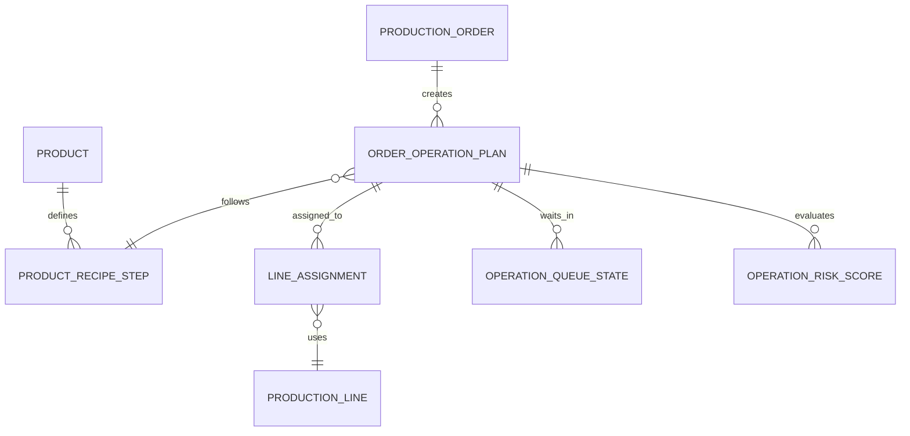

# Order Assignment Logic

## Amaç

Bu doküman siparişlerin hatlara nasıl atanacağını ve sistemin teslim riski, kuyruk, darboğaz ve kapasite etkisini nasıl hesaplayacağını tanımlar.

Factory Runway'de sipariş yönetimi sadece `kabul et / reddet` kararı olmamalıdır. Oyuncu siparişi kabul ettikten sonra hangi operasyonun hangi departmandan geçeceğini, hangi hatta atanacağını ve hangi aşamanın teslim riskini büyüttüğünü görmelidir.

## Ana Akış

```text
Sipariş kabul edilir
-> Ürün operasyon reçetesi okunur
-> Gerekli departman sırası belirlenir
-> Malzeme / kumaş hazır olma günü hesaplanır
-> Her operasyon için uygun line adayları aranır
-> Oyuncu veya sistem line ataması yapar
-> Hat doluysa kuyruk oluşur
-> Darboğaz hesaplanır
-> Tahmini bitiş tarihi ve teslim riski çıkar
```

Bu akış oyunun ana karar motorlarından biridir.

## Ürün Reçetesinden Rota Çıkarma

Ürün reçetesi operasyon adımlarından oluşur.

Örnek:

```text
Cameo - Baskılı Basic T-Shirt
1. Kumaş Depo
2. Kesim
3. Baskı
4. Dikim
5. Ütü/Paket
6. Sevkiyat
```

Her reçete adımı şu bilgileri taşımalıdır:

```text
ProductRecipeStep
- id
- productId
- stepOrder
- operationType
- requiredDepartmentType
- requiredCapability
- inputBufferType
- outputBufferType
- minutesPerUnit
- externalLeadDays
- qualityCheckRequired
- canUseSubcontractor
```

İç üretim ve fason ayrımı:

```text
minutesPerUnit:
Fabrika içinde dakika/adet hesabı.

externalLeadDays:
Fason veya dış tedarik gün hesabı.
```

## Uygun Hat Arama

Her operasyon için sistem uygun line adaylarını bulur.

Kontrol listesi:

- Line doğru departmanda mı?
- Line operasyonu destekliyor mu?
- Gerekli capability açık mı?
- Line boş mu veya ne zaman boşalacak?
- Gerekli input kuyruğu var mı / ne zaman oluşacak?
- Line verimliliği yeterli mi?
- Line bakım riski yüksek mi?
- Ürün katmanı line seviyesine uygun mu?

Önerilen aday skoru:

```text
lineSuitabilityScore =
capabilityMatchScore
+ efficiencyScore
+ queueFitScore
+ dueDateUrgencyScore
- currentLoadPenalty
- maintenanceRiskPenalty
- qualityRiskPenalty
```

Oyuncuya tam skor gösterilmez; sade öneri gösterilir.

```text
Dikim Hat 01 daha verimli ama bugün dolu.
Dikim Hat 03 hemen başlayabilir fakat bakım riski var.
```

## Manuel ve Önerilen Atama

İki atama modu olmalıdır:

```text
Manual Assignment:
Oyuncu siparişi belirli line'lara kendisi atar.

Suggested Assignment:
Sistem teslim tarihi ve kapasiteye göre öneri verir.
```

MVP'de öneri basit olabilir:

```text
En erken başlayabilecek ve en yüksek uygunluk skoruna sahip line önerilir.
```

İleride:

- Kar maksimizasyonu.
- Teslim riski minimizasyonu.
- Boş kapasite değerlendirme.
- Ara fırsat sıkıştırma.
- Müşteri önceliği.

## Siparişin Birden Fazla Hatta Bölünmesi

Büyük siparişlerde bir operasyon aynı departmandaki birden fazla hatta bölünebilir.

Örnek:

```text
S-02471 / Dikim
- Hat 01: 1.500 adet
- Hat 03: 1.000 adet
- Hat 04: 1.500 adet
```

Dağıtım hesapları:

```text
assignedQuantityByLine =
orderRemainingQuantity * lineCapacityShare
```

Oyuncu isterse adet dağılımını manuel değiştirebilir.

## Kuyruk ve Hazır Olma Mantığı

Her operasyon bir önceki adımın çıktısını bekler.

Örnek:

```text
Kesim tamamlanır -> CUT_READY oluşur.
Baskı gerekiyorsa -> PRINT_READY beklenir.
Dikim -> PRINT_READY veya CUT_READY tüketir.
Dikim tamamlanır -> SEWN_READY oluşur.
Ütü/Paket -> SEWN_READY tüketir.
```

Bir line'ın başlayabilmesi için:

```text
inputBufferQuantity > 0
veya
inputBufferReadyDate tahmini uygun olmalıdır.
```

Line input bekliyorsa:

```text
Status: WaitingInput
Mesaj: Dikim Hat 02 kesim kuyruğu bekliyor.
```

## Darboğaz Hesabı

Darboğaz sadece tek günlük kapasite aşımı değildir. Kuyruk birikimi ve teslim tarihi etkisi birlikte değerlendirilmelidir.

Temel metrikler:

```text
departmentLoadRate = plannedMinutes / availableMinutes
queueDays = queueQuantity / nextDepartmentDailyCapacity
waitingLineMinutes = input eksikliği nedeniyle beklenen süre
dueDateSlack = dueDay - estimatedCompletionDay
```

Yorum:

```text
departmentLoadRate > 110%:
Kapasite aşımı.

queueDays > 7:
Bir sonraki departman yetersiz kalıyor olabilir.

dueDateSlack < 1:
Teslim riski yüksek.
```

Oyuncu mesajı:

```text
Bu siparişi alırsan dikim hattın sıkışacak.
Paketleme boş görünüyor, fakat dikim yetişmediği için avantaj oluşmuyor.
```

## Teslim Riski Hesabı

Basit risk seviyesi:

```text
estimatedCompletionDay <= dueDay - 1 -> Güvenli
estimatedCompletionDay == dueDay -> Dikkat
estimatedCompletionDay > dueDay -> Riskli
```

Risk katsayıları:

- Fason süresi ve fason güvenilirliği.
- Maintenance risk.
- Kuyruk gün karşılığı.
- Kritik departman kapasite aşımı.
- Ürün katmanı.
- Kalite kontrol ihtiyacı.
- Kumaş / aksesuar hazır olma günü.

Oyuncuya gösterilecek sade etiketler:

```text
Güvenli
Dikkat
Riskli
Yetişmez
```

## Fason Operasyon Ataması

Oyuncunun fabrikasında capability yoksa operasyon fasona gidebilir.

Fason adımı line ataması gibi değil, dış teslim gününe göre planlanır.

```text
Kesim tamamlandı.
Baskı capability yok.
Fason baskı seçildi.
ExternalLeadDays: 4
Baskı dönüş günü: Day 9
Dikim en erken Day 9 başlar.
```

Fason gecikmesi olursa sistem ilgili downstream line'ları tekrar hesaplar.

```text
Baskı dönüşü 2 gün gecikti.
Dikim Hat 01'in planı boşluk oluşturuyor.
Teslim riski orta seviyeden yüksek seviyeye çıktı.
```

## Sipariş Kabul Ekranı Önizlemesi

Teklif kabul edilmeden önce sistem plan etkisini hesaplamalıdır.

Gösterilecek sinyaller:

- Gerekli operasyonlar.
- Eksik capability.
- Fason süresi.
- Departman yoğunluk etkisi.
- En kritik departman.
- Tahmini teslim riski.
- Önerilen line sayısı.

Örnek:

```text
Bu sipariş için öneri:
- Kesim: 1 hat yeterli.
- Baskı: Fason gerekir, 4 gün.
- Dikim: En az 3 hat önerilir.
- Ütü/Paket: Day 10'da dikkat.

Ana risk: Dikim.
```

## MVP Kapsamı

- Ürün reçetesinden operasyon rotası çıkarma.
- Department ve line uygunluğu kontrolü.
- Manuel line atama.
- Basit sistem önerisi.
- Aynı siparişi birden fazla line'a bölme.
- Kuyruk ve input bekleme mantığı.
- Teslim riski hesaplama.
- Fason adımının rotaya eklenmesi.
- Sipariş kabul ekranında plan etkisi.

## İleride Genişletilecek Alanlar

- Otomatik plan optimizasyonu.
- Senaryo karşılaştırma.
- Kar / risk bazlı öneri motoru.
- Line setup süresi.
- Ürün değişim cezası.
- Müşteri önceliğine göre kapasite ayırma.
- Premium / Luxury kalite kapıları.

## ER Taslağı



## Örnek

```text
Sipariş: S-02471
Ürün: Cameo Baskılı T-Shirt
Adet: 2.000
Teslim: Day 12

Rota:
Depo -> Kesim -> Baskı -> Dikim -> Ütü/Paket -> Sevkiyat

Plan:
Kesim 01: Day 5-6
Baskı: Fason, Day 6-10
Dikim Hat 01: Day 10-12
Dikim Hat 03: Day 10-12
Ütü/Paket 01: Day 12

Risk:
Dikim sıkışık.
Ütü/Paket güvenli.
Teslim: Dikkat.
```
